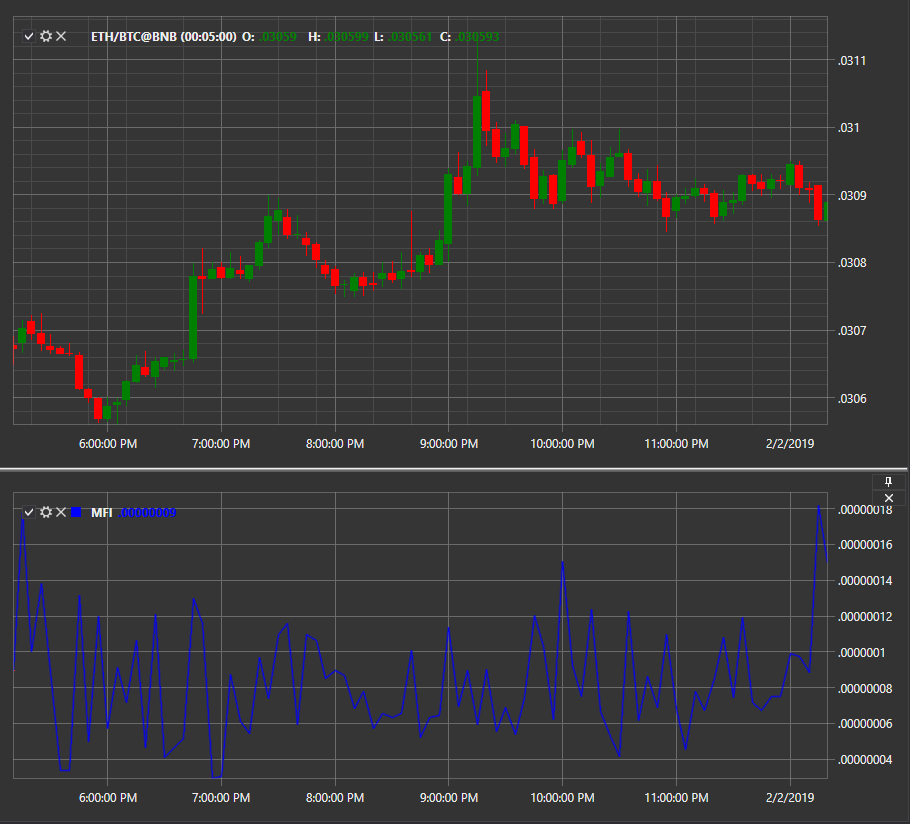

# Market Facilitation Index

**Market Facilitation Index (MFI)** is an indicator that evaluates the market readiness to move the price. Absolute indicator values cannot give any trading signals, unlike its dynamics in relation to volume dynamics. 

To use the indicator, you must use the [MarketFacilitationIndex](../api/StockSharp.Algo.Indicators.MarketFacilitationIndex.html) class. 

## Recommended content

[Mean Deviation](IndicatorMeanDeviation.md)
