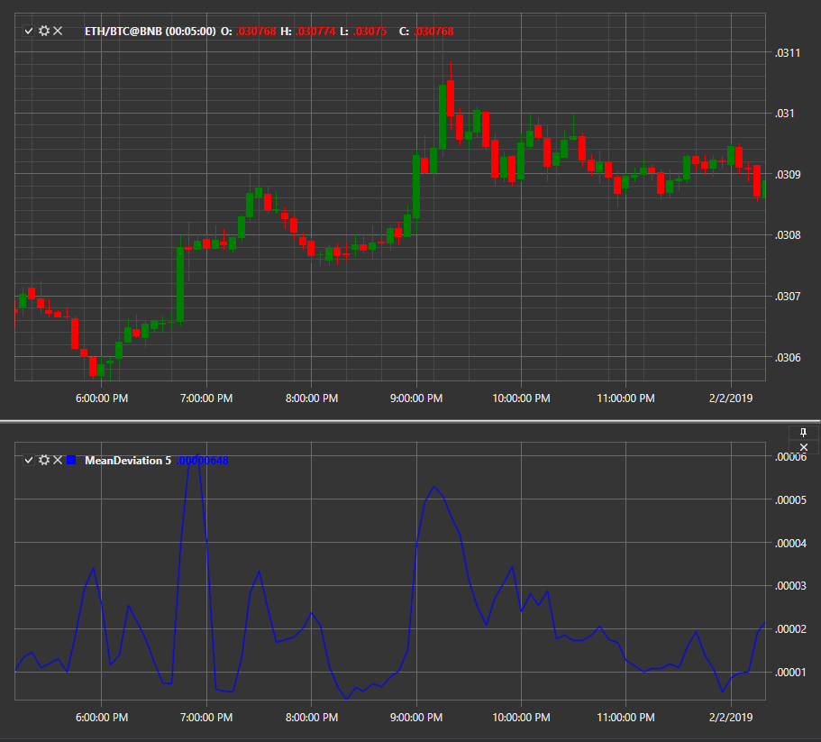

# Mean Deviation

**Mean Deviation **indicator shows the average deviation for the period. 

To use the indicator, you must use the [MeanDeviation](xref:StockSharp.Algo.Indicators.MeanDeviation) class. 

## Recommended content

[Median Price](IndicatorMedianPrice.md)
