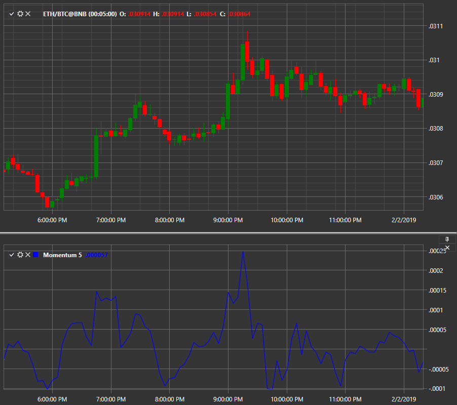

# Momentum

**Momentum** indicator indicates overbought and oversold moments when the curve reaches its maximum or minimum values. Adding a smoothed moving average with the indicator improves the interpretation of trend changes. 

To use the indicator, you must use the [Momentum](../api/StockSharp.Algo.Indicators.Momentum.html) class. 

## Recommended content

[Money Flow Index](IndicatorMoneyFlowIndex.md)
