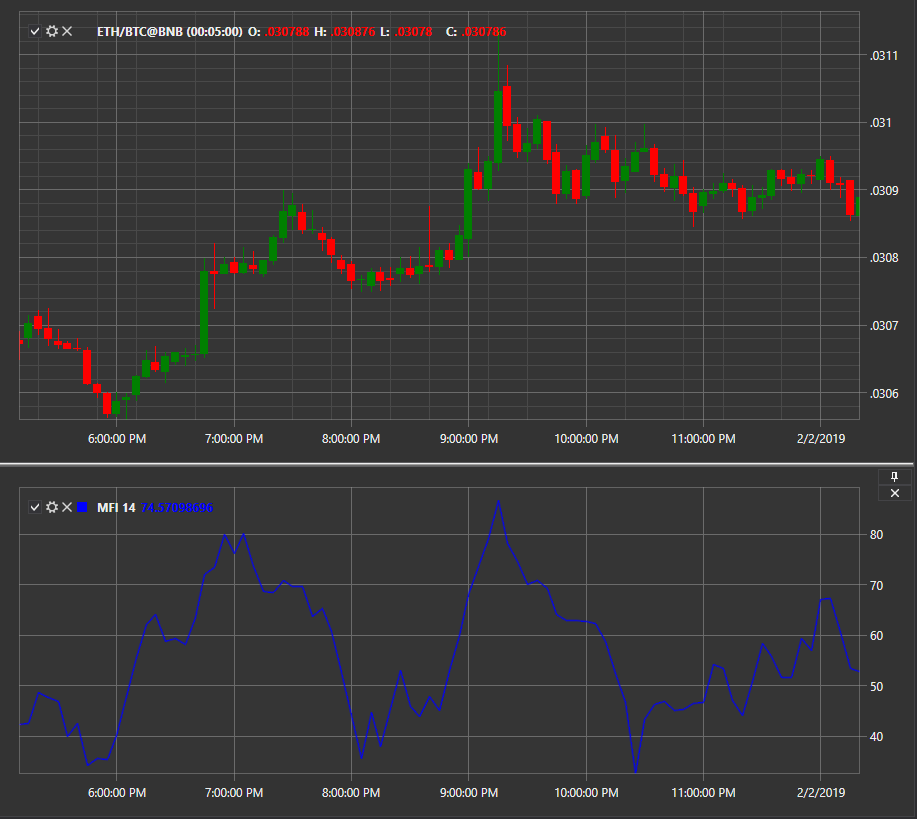

# Money Flow Index

**Money Flow Index (MFI)** calculates the difference between incoming and outgoing money flows. If the base value of the asset is below the difference, it indicates an increase in incoming money mass, meaning the market is bullish. If the opposite is observed, it means investors are leaving the instrument, and the market is bearish.  
The indicator is a technical oscillator for determining overbought or oversold conditions in an asset. It can also be used to identify divergences that warn of a trend change in price. The oscillator moves between 0 and 100.

To use the indicator, the [MoneyFlowIndex](xref:StockSharp.Algo.Indicators.MoneyFlowIndex) class should be used.

## See Also

[MACD](IndicatorMovingAverageConvergenceDivergence.md)
