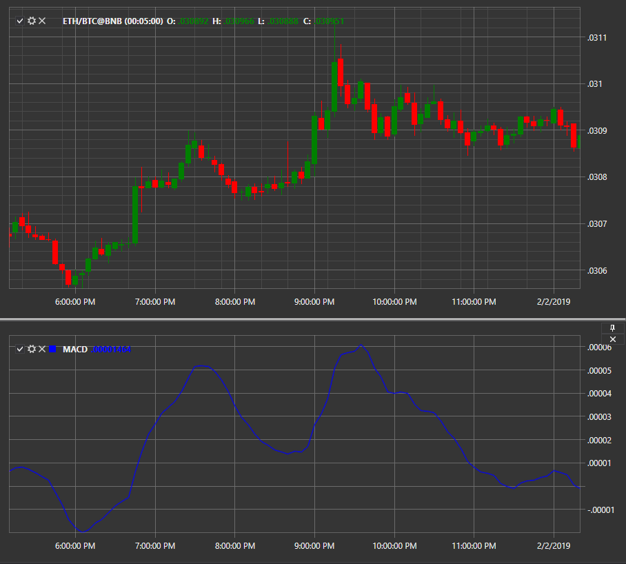

# MACD

**Moving Averages Convergence\-Divergence (MACD)** is a momentum indicator that shows the relationship between two moving averages of a security price. 

To use the indicator, you must use the [MovingAverageConvergenceDivergence](../api/StockSharp.Algo.Indicators.MovingAverageConvergenceDivergence.html) class. 

## Recommended content

[MACD histogram](IndicatorMovingAverageConvergenceDivergenceHistogram.md)
