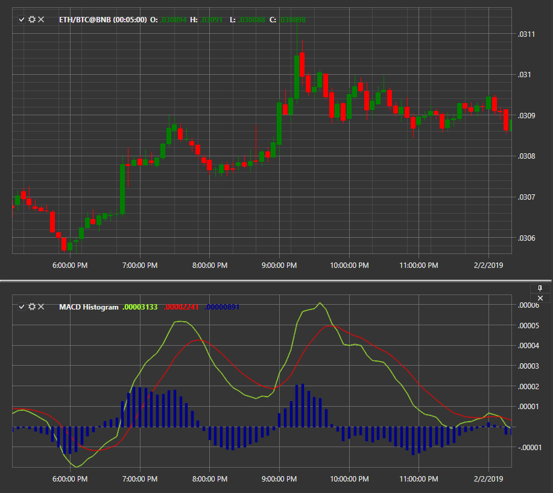

# MACD histogram

**Moving Averages Convergence\-Divergence (MACD)** is a momentum indicator that shows the relationship between two moving averages of a security price. It is shown as a histogram. 

To use the indicator, you must use the [MovingAverageConvergenceDivergenceHistogram](xref:StockSharp.Algo.Indicators.MovingAverageConvergenceDivergenceHistogram) class. 

## Recommended content

[MACD with signal line](IndicatorMovingAverageConvergenceDivergenceSignal.md)
