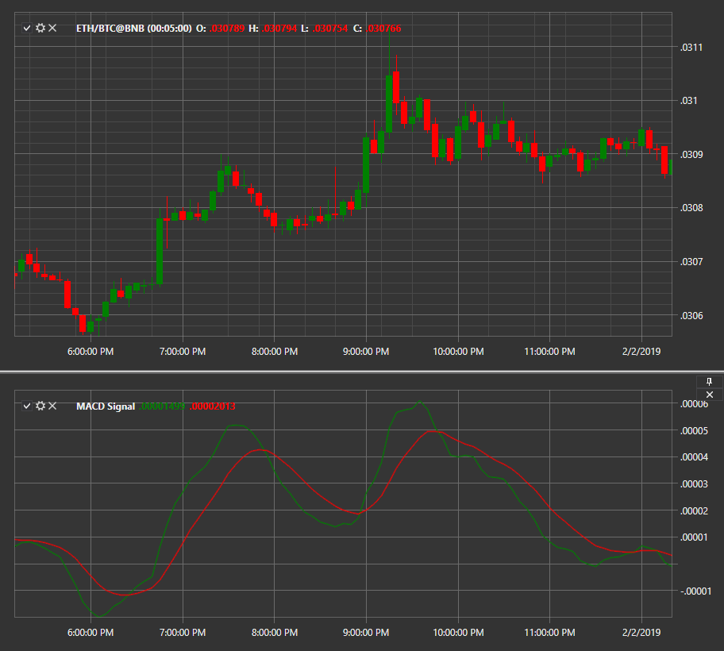

# MACD with signal line

**Moving Averages Convergence\-Divergence (MACD)** is a momentum indicator that shows the relationship between two moving averages of a security price. It is shown with a signal line. 

To use the indicator, you must use the [MovingAverageConvergenceDivergenceSignal](../api/StockSharp.Algo.Indicators.MovingAverageConvergenceDivergenceSignal.html) class. 

## Recommended content

[NRTR](IndicatorNickRypockTrailingReverse.md)
