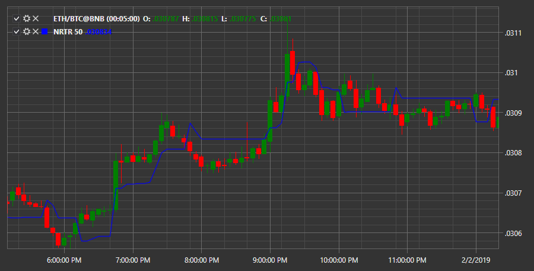

# NRTR

**Nick Rypock Trailing reverse (NRTR)** — the indicator essence is that it is always on the segment from the reached price extremes. The following idea was implemented here: small corrective movements against the main trend should be ignored, and the movement against the main trend above some level signals an inverse trend. 

To use the indicator, you must use the [NickRypockTrailingReverse](xref:StockSharp.Algo.Indicators.NickRypockTrailingReverse) class. 

## Recommended content

[Parabolic SAR](IndicatorParabolicSar.md)
