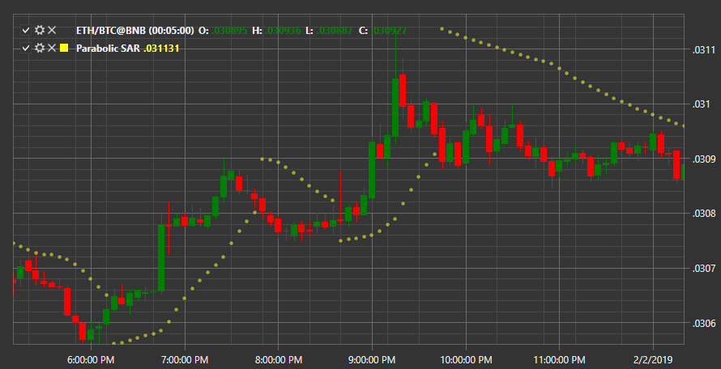

# Parabolic SAR

**Parabolic SAR (SAR)** \- The trend indicator that indicates the price stop and reversal points, as well as the trend direction. 

To use the indicator, you must use the [ParabolicSar](../api/StockSharp.Algo.Indicators.ParabolicSar.html) class. 

## Recommended content

[Peak](IndicatorPeak.md)
