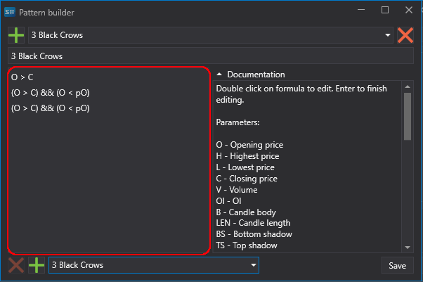

# Pattern

A **Pattern** in technical analysis refers to stable, recurring combinations of price data, volume, or indicators. Pattern analysis is based on one of the axioms of technical analysis: "history repeats itself" — it's believed that recurring data combinations lead to similar outcomes.

Patterns are also called "templates" or "figures" of technical analysis.

Patterns are conventionally divided into:

- Indeterminate (can lead to either a continuation or a change of the current trend).
- Patterns of continuation of the current trend.
- Patterns of changing the existing trend.

In [Designer](Designer.md), preset candle patterns are built-in, which can be used in your trading strategy. Patterns are called through the [indicator](Designer_Indicator.md) cube with subsequent selection of the appropriate value. The pattern itself is selected from the dropdown list in the right window.

It's also possible to edit existing and add custom user patterns. To do this, you need to click on the  button, after which the pattern editing window will be displayed.

To create your own pattern, you need to press the  button at the top of the window. Pressing the  button deletes a pattern. Pattern editing is done in the left window (highlighted area in the picture). Each row represents a separate candle. The top row is the current candle, accordingly, the second row is one candle back, and the third and subsequent rows correspondingly minus 2 and more candles.

The editor uses the following parameters:
- O - opening price,
- H - high,
- L - low,
- C - closing price,
- V - volume,
- OI - open interest,
- B - body of the candle,
- LEN - length of the candle (from high to low),
- BS - lower shadow of the candle,
- TS - upper shadow of the candle.

It's possible to use the following indexes (references) for the required values. For example, for the closing price:
- C: closing price of the current candle,
- C1: closing price of the 1st candle after the current,
- C2: closing price of the 2nd candle after the current,
- pC: closing price of the previous candle,
- pC1: closing price of the candle before the previous one,
All references must be within the current pattern range. For example, the range of the 3 Black Crows pattern consists of the current and two previous candles, accordingly, referring to the third previous candle is not allowed.

For additional verification of parameters in relation, the && expression representing a logical AND is used.

When describing a pattern, it's also possible to use the following functions: abs, acos, asin, atan, ceiling, cos, exp, floor, log, log10, max, min, pow, round, sign, sin, sqrt, tan, truncate. More about the use of functions is described in the [formula](Designer_Universal_formula.md) cube description.

The bottom part of the window is designed for quick creation of patterns based on existing ones. Pressing the  button at the bottom of the window adds the logic of the pattern selected from the dropdown list opposite to the editing window. The  button at the bottom of the window deletes the selected row in the editing window.

## See Also

[Formula](Designer_Universal_formula.md)
