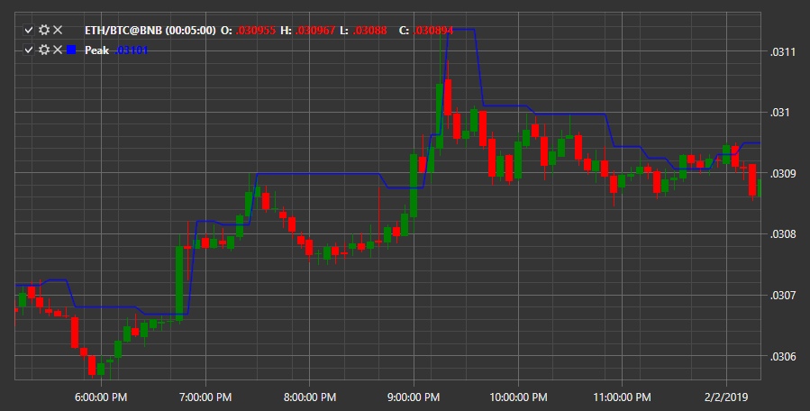

# Peak

**Peak** indicator shows the peak value for the period. 

To use the indicator, you must use the [Peak](../api/StockSharp.Algo.Indicators.Peak.html) class. 

## Recommended content

[QStick](IndicatorQStick.md)
