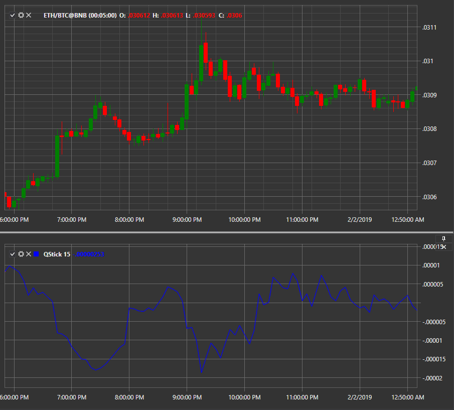

# QStick

**Qstick** is a technical indicator used to determine trends on candle charts. It is calculated by taking the moving average for N periods from the difference between open and close prices. The positive Qstick value means that the buying pressure increases. 

To use the indicator, you must use the [QStick](../api/StockSharp.Algo.Indicators.QStick.html) class. 

## Recommended content

[RAVI](IndicatorRangeActionVerificationIndex.md)
