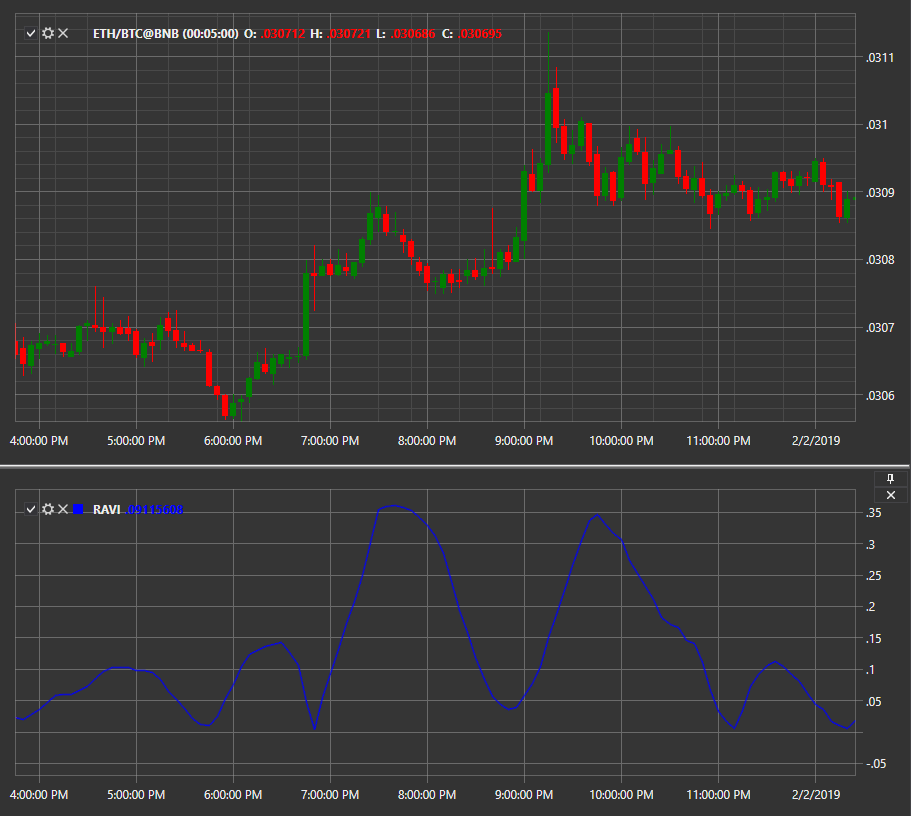

# RAVI

**Range Action Verification Index (Ravi)** is a technical analysis indicator that determines the presence of a trend in the market and its direction, based on a pair of simple moving averages with customizable periods. 

To use the indicator, you must use the [RangeActionVerificationIndex](../api/StockSharp.Algo.Indicators.RangeActionVerificationIndex.html) class. 

## Recommended content

[RoC](IndicatorRateOfChange.md)
