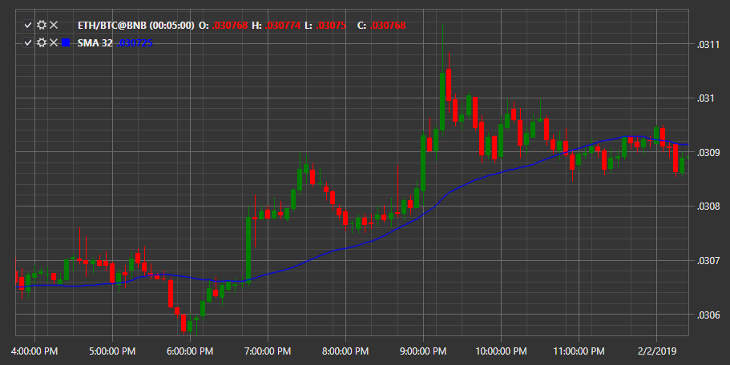

# SMA

**Simple Moving Average (SMA)** is an arithmetic moving average calculated by adding the last closing prices and dividing this number by the number of time periods. 

To use the indicator, you must use the [SimpleMovingAverage](xref:StockSharp.Algo.Indicators.SimpleMovingAverage) class. 

## Recommended content

[Smoothed MA](IndicatorSmoothedMovingAverage.md)
