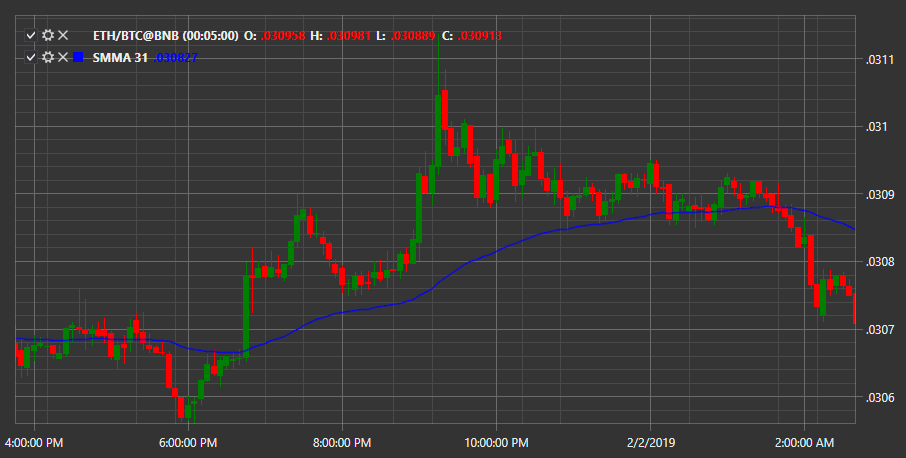

# Smoothed MA

**Smoothed Moving Average (SMA)** \- the indicator displays the smoothed average price direction for a certain time period. 

To use the indicator, you must use the [SmoothedMovingAverage](../api/StockSharp.Algo.Indicators.SmoothedMovingAverage.html) class. 

## Recommended content

[Standard Deviation](IndicatorStandardDeviation.md)
