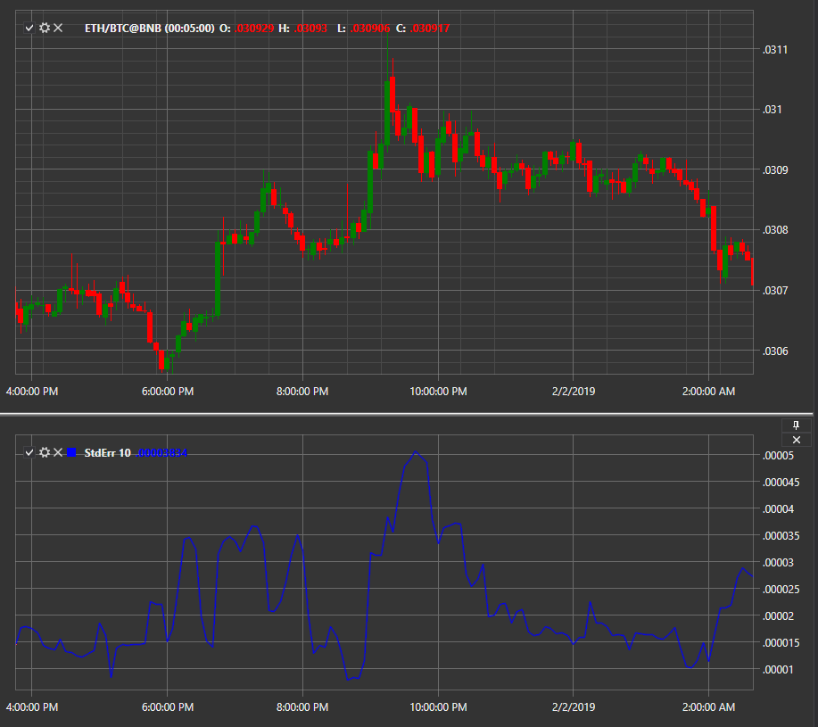

# Standard Error

**Standard Error** indicator is an estimate of the mean square deviation of the regression coefficient from its true value. 

To use the indicator, you must use the [StandardError](../api/StockSharp.Algo.Indicators.StandardError.html) class. 

## Recommended content

[Alligator](IndicatorAlligator.md)
