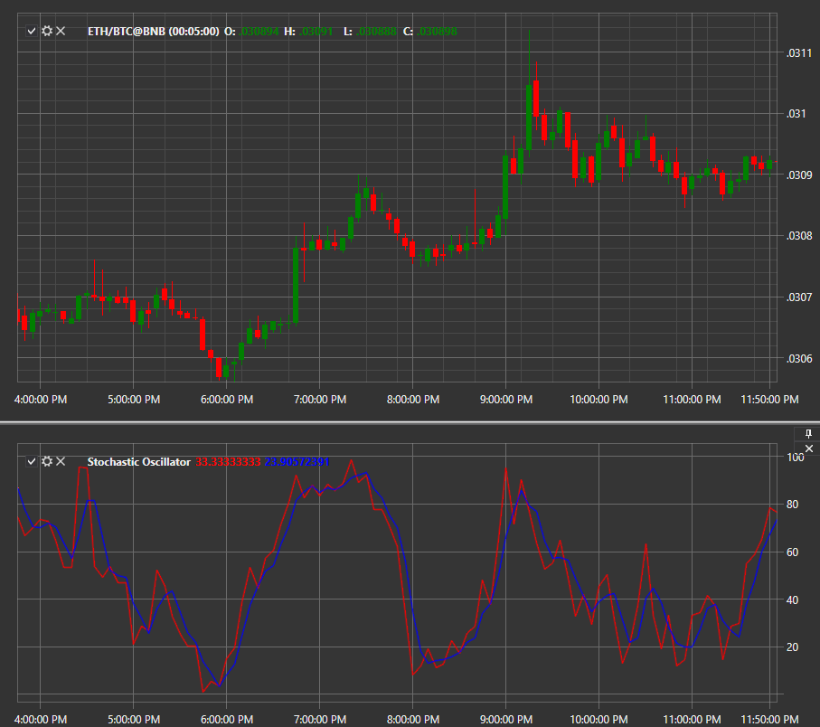

# Stochastic Oscillator

**Stochastic Oscillator** is a momentum indicator that compares a specific closing price of a security with a range of its prices for a certain time period. The oscillator sensitivity to market movements can be reduced by adjusting this time period or taking the moving average from the result. 

To use the indicator, you must use the [StochasticOscillator](xref:StockSharp.Algo.Indicators.StochasticOscillator) class. 

## Recommended content

[Sum N](IndicatorSum.md)
