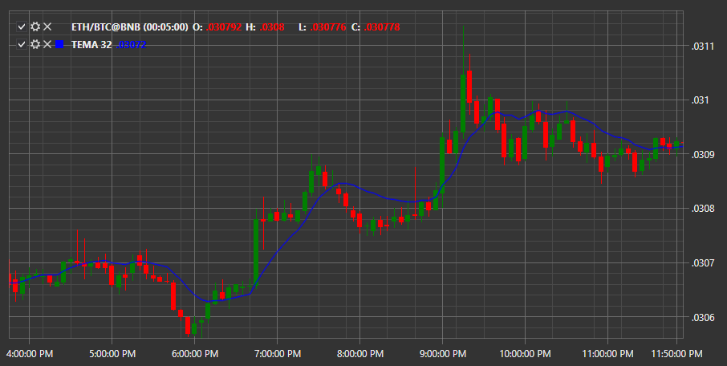

# TEMA

**Triple Exponential Moving Average (TEMA)** uses multiple (triple) Exponential Moving Averages (EMA) to eliminate lags when forecasting prices. 

To use the indicator, you must use the [TripleExponentialMovingAverage](../api/StockSharp.Algo.Indicators.TripleExponentialMovingAverage.html) class. 

## Recommended content

[TRIX](IndicatorTrix.md)
