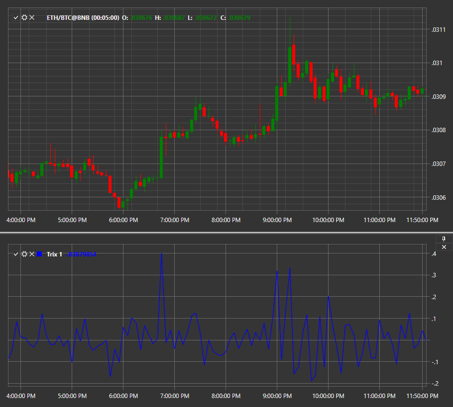

# TRIX

**TRIX** is an oscillator used to determine oversold and overbought markets or as a momentum indicator. Like many oscillators, TRIX oscillates around the zero line. When it is used as an oscillator, a positive value indicates the overbought market and a negative value indicates the oversold market. When TRIX is used as a momentum indicator, a positive value indicates an increase in the momentum and a negative value indicates a decrease in the momentum. 

To use the indicator, you must use the [Trix](../api/StockSharp.Algo.Indicators.Trix.html) class. 

## Recommended content

[Trough](IndicatorTrough.md)
