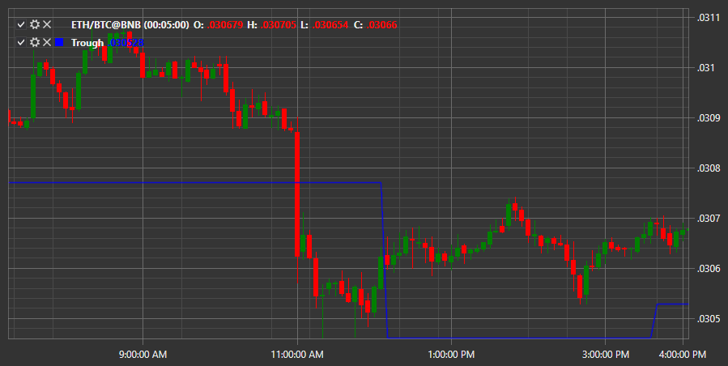

# Trough

**Trough** indicator shows the minimum value for the period. 

To use the indicator, you must use the [Trough](xref:StockSharp.Algo.Indicators.Trough) class. 

## Recommended content

[True Range](IndicatorTrueRange.md)
