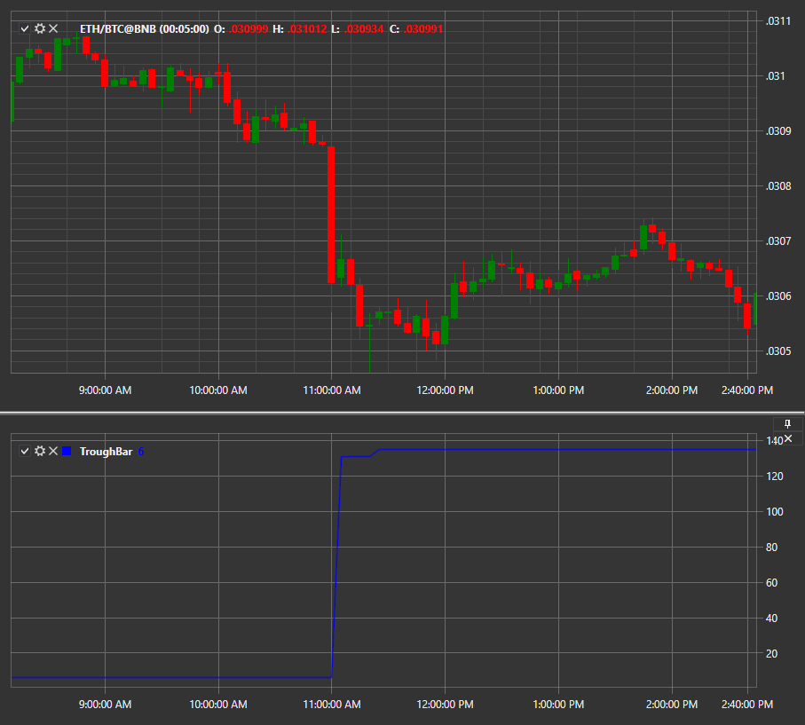

# TroughBar

**TroughBar** indicator returns the minimum price value, the percentage reduction is the main parameter for determining the new minimum. 

To use the indicator, you must use the [TroughBar](xref:StockSharp.Algo.Indicators.TroughBar) class. 

## Recommended content

[TRIX](IndicatorTrix.md)
