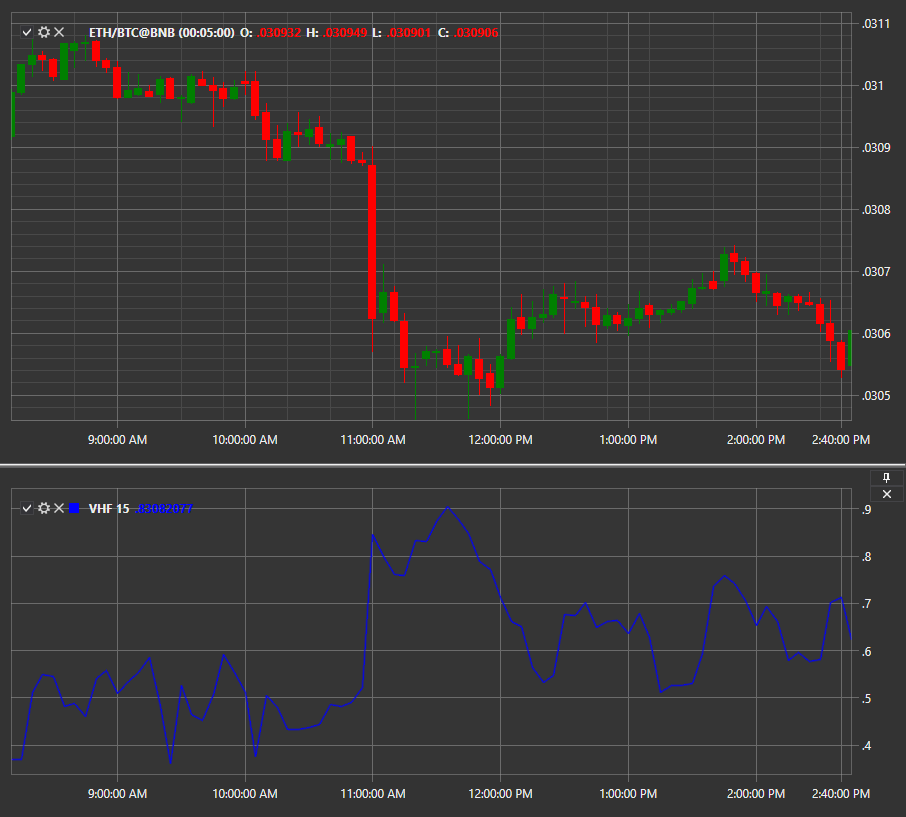

# VHF

**Vertical Horisontal Filter (VHF)** \- The vertical horizontal filter indicator was developed by Adam White in 1991. This indicator is used in technical analysis to recognize periods when the price is in a trend (uptrend or downtrend) or this indicator is in an overload phase (side trend). 

To use the indicator, you must use the [VerticalHorizontalFilter](xref:StockSharp.Algo.Indicators.VerticalHorizontalFilter) class. 

## Recommended content

[Volume](IndicatorVolumeIndicator.md)
