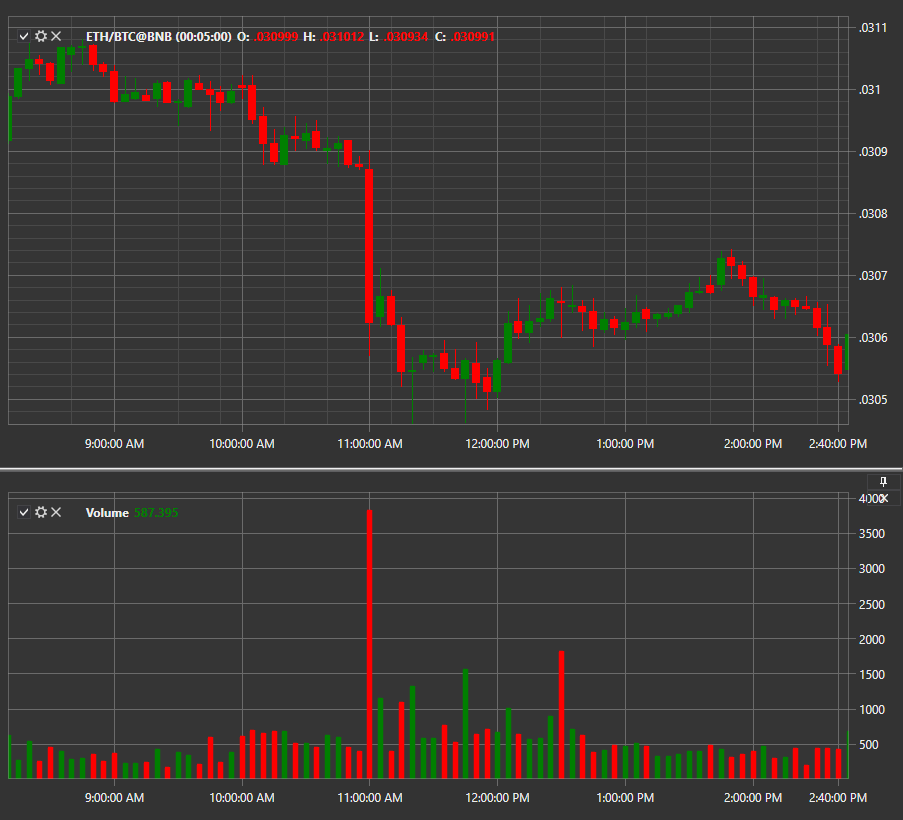

# Volume

**Candle volume** indicator shows candle volume. 

To use the indicator, you must use the [VolumeIndicator](xref:StockSharp.Algo.Indicators.VolumeIndicator) class. 

## Recommended content

[Volume Profile](IndicatorVolumeProfileIndicator.md)
