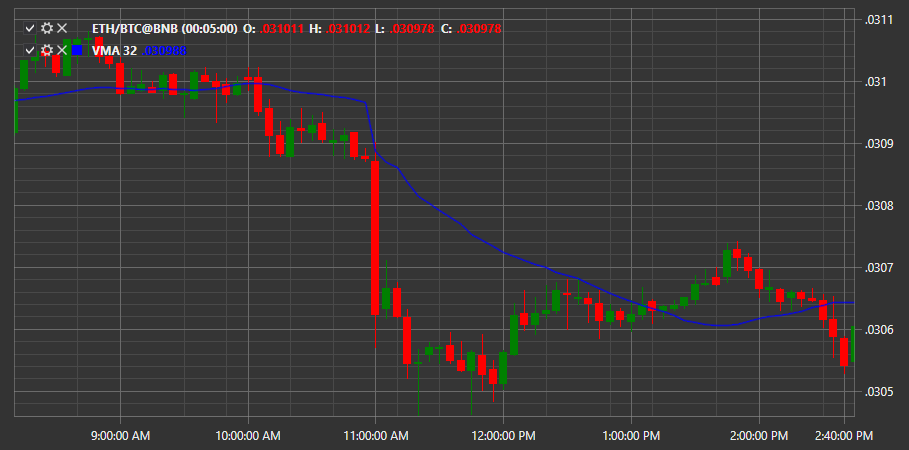

# Weighted MA

**Weighted Moving Average (WMA)** \- the indicator displays the weighted average price for a certain time period. This indicator follows the price as a wavy line, has a certain deviation relative to the price chart. 

To use the indicator, you must use the [WeightedMovingAverage](xref:StockSharp.Algo.Indicators.WeightedMovingAverage) class. 

## Recommended content

[%R](IndicatorWilliamsR.md)
