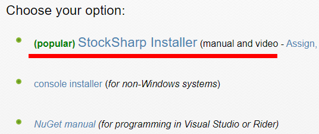
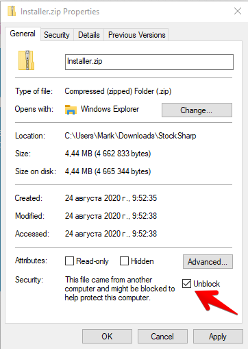
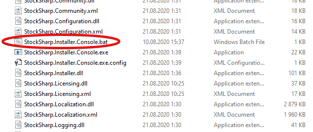
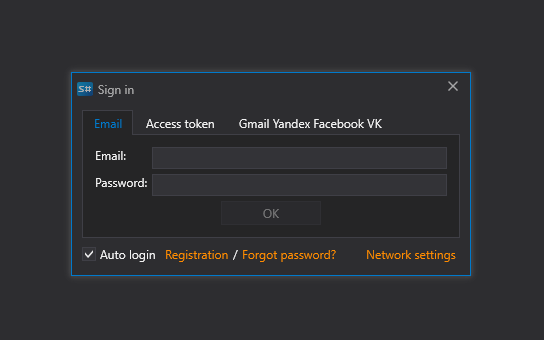

# Setup

1. To install [S\#.Installer](SharpInstaller.md) go to the Download page [Download](https://stocksharp.com/products/download/):

   
2. Download the [S\#.Installer](SharpInstaller.md) distribution package.
3. Unblock (right click on the file, properties) **Installer.zip**.

   
4. Unpack the archive and, in the folder with the unpacked archive, find the **StockSharp.Installer.Console.bat** file. 

   Run it.

   
5. Installation mode starts. You should wait for the complete installation. When installing for the first time, you should enter the **StockSharp** login and password.

   
6. After installation, the program window will open.

   

**Watch [video tutorial](InstallerSetup.md)**

## Recommended content

[Install  and remove apps](Installer_installing_removing_programs.md)
