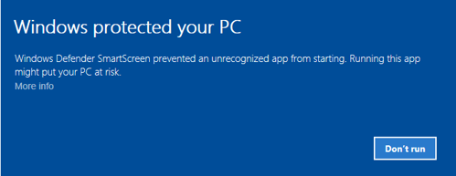
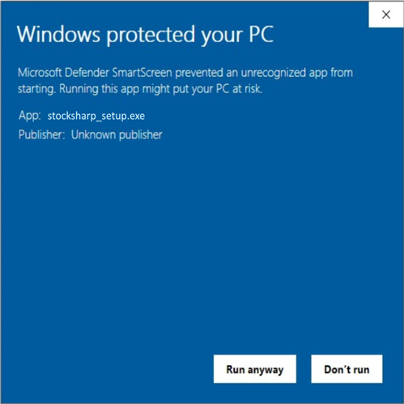

# First Run

1. To install [Installer](SharpInstaller.md), go to the [Download](https://stocksharp.com/products/download/) page:
   
    

2. Download the [Installer](SharpInstaller.md) distribution.
3. Run the installation file **stocksharp_setup.exe** and follow the installer instructions.
4. Sometimes, Windows does not start the installation immediately and displays a warning:

   

5. In this case, click on the **More info** link in the warning window, after which the following window will appear:

    

    By clicking the **Run anyway** button, you will start the installation of [Installer](SharpInstaller.md).

6. The unpacking of [Installer](SharpInstaller.md) will start. You need to wait for the unpacking to complete.
7. For the first installation, you need to enter the **StockSharp** login and password.

    

    The login can be performed either through direct input of login and password or via authorization through a social network (in the case of registration on the StockSharp website in this way, there will be no password).

8. After logging in, the program window will open. 

**Watch the [video tutorial](InstallerSetup.md)**

## See also

[Installing and Removing Programs](Installer_installing_removing_programs.md)