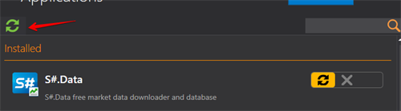
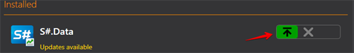

# Update apps

[S\#.Installer](SharpInstaller.md) keeps track of all software updates and updates itself automatically. Therefore, there is no need to uninstall it after installation. 

To check for available updates manually, you should click on the **Updates** button in the right corner of the program window. 

If updates are available for the program, [S\#.Installer](SharpInstaller.md) will notify you accordingly. 

Then you need to click the button.

[S\#.Installer](SharpInstaller.md) is not closed by clicking on the **"X"** in the program window, but is closed using the toolbar.

To do this, go to the menu by right\-clicking and click **Close**.

**Watch [video tutorial](InstallerUpdateProgramsVideo.md)**.

## Recommended content

[Install  and remove apps](Installer_installing_removing_programs.md)
