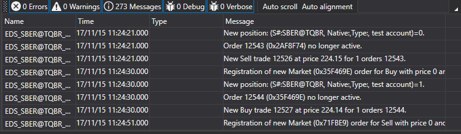

# Visual monitoring

For simplifying the monitoring of the work, you can use the special [MonitorWindow](xref:StockSharp.Xaml.MonitorWindow) window. See also [Visual logging components](GuiLogging.md). 



This window allows you to display messages from all [ILogSource](xref:StockSharp.Logging.ILogSource): 

- strategies ([Strategy](xref:StockSharp.Algo.Strategies.Strategy));
- connectors ([IConnector](xref:StockSharp.BusinessEntities.IConnector));
- own [ILogSource](xref:StockSharp.Logging.ILogSource) implementations (for example, the main window in the algorithm).

The nesting of sources is showing in the form of a tree. Each parent node contains messages of all nested and so on, until the lowest level. For strategies such hierarchy allows you to see [child strategies](StrategyChilds.md). For connectors it is also useful in the case of [BasketTrader](API_Connectors.md). using. Similarly, the same nesting can be arranged for your own algorithm, implementing the [ILogSource.Parent](xref:StockSharp.Logging.ILogSource.Parent) property. 

## MonitorWindow using

1. First, you need to create a window:

   ```cs
   var monitor = new MonitorWindow();
   monitor.Show();
   ```
2. Then, the created window must be added to your [LogManager](xref:StockSharp.Logging.LogManager) through the [GuiLogListener](xref:StockSharp.Xaml.GuiLogListener):

   ```cs
   _logManager.Listeners.Add(new GuiLogListener(monitor));
   ```
3. Thereafter all sources [LogManager.Sources](xref:StockSharp.Logging.LogManager.Sources) (strategies, connectors, etc.) will send messages to the [MonitorWindow](xref:StockSharp.Xaml.MonitorWindow).

## Recommended content

[Visual logging components](GuiLogging.md)
