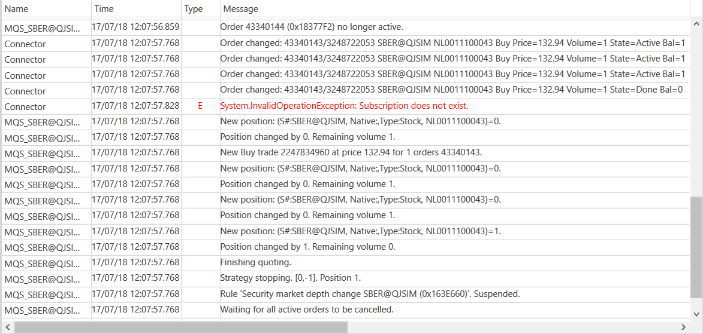

# Strategy logging

The [Strategy](../api/StockSharp.Algo.Strategies.Strategy.html) class implements the [ILogSource](../api/StockSharp.Logging.ILogSource.html) interface. Therefore, the strategies can be passed to the [LogManager.Sources](../api/StockSharp.Logging.LogManager.Sources.html), and all of its messages will automatically get to the [LogManager.Listeners](../api/StockSharp.Logging.LogManager.Listeners.html). 

### Prerequisites

[Trading strategies](Strategy.md)

### Logging in to test file

Logging in to test file

1. First, you need to create the special manager: 

   ```cs
   var logManager \= new LogManager();
   ```
2. Then you need to create a file logger, passing to it the name of the file and to add it to the [LogManager.Listeners](../api/StockSharp.Logging.LogManager.Listeners.html): 

   ```cs
   var fileListener \= new FileLogListener("{0}\_{1:00}\_{2:00}.txt".Put(DateTime.Now.Year, DateTime.Now.Month, DateTime.Now.Day));
   logManager.Listeners.Add(fileListener);
   ```
3. For logging messages, you need to add a strategy to the [LogManager.Sources](../api/StockSharp.Logging.LogManager.Sources.html): 

   ```cs
   logManager.Sources.Add(lkohSmaStrategy);
   ```
4. After adding strategy to the logging manager all of its messages will be recorded to file. 

### Sound playback

Sound playback

1. Creating a logger and passing the name of the sound file in it: 

   ```cs
   var soundListener \= new SoundLogListener("error.mp3");
   						
   logManager.Listeners.Add(soundListener);
   logManager.Sources.Add(lkohSmaStrategy);
   ```
2. Setting the filter in the sound playback only when the type of messages is [LogLevels.Error](../api/StockSharp.Logging.LogLevels.Error.html): 

   ```cs
   soundListener.Filters.Add(msg \=\> msg.Level \=\= LogLevels.Error);
   ```

### Email sending

Email sending

1. The logger creating and passing to it sent letters parameters: 

   ```cs
   var emailListener \= new EmailLogListener("from@stocksharp.com", "to@stocksharp.com");
   logManager.Listeners.Add(emailListener);
   logManager.Sources.Add(lkohSmaStrategy);
   ```
2. Setting the filter on the sending of messages of [LogLevels.Error](../api/StockSharp.Logging.LogLevels.Error.html) and [LogLevels.Warning](../api/StockSharp.Logging.LogLevels.Warning.html) types: 

   ```cs
   emailListener.Filters.Add(msg \=\> msg.Level \=\= LogLevels.Error);
   emailListener.Filters.Add(msg \=\> msg.Level \=\= LogLevels.Warning);
   ```

### Logging in to the LogWindow

Logging in to the LogWindow

1. The [GuiLogListener](../api/StockSharp.Xaml.GuiLogListener.html) logger creating: 

   ```cs
   \/\/ each strategy will have they own windows
   var guiListener \= new GuiLogListener();
   logManager.Listeners.Add(guiListener);
   logManager.Sources.Add(lkohSmaStrategy);
   ```
2. Here is the log window when orders quoting strategy working ([Quoting](StrategyQuoting.md)): 

   

## Recommended content

[Visual logging components](GuiLogging.md)
