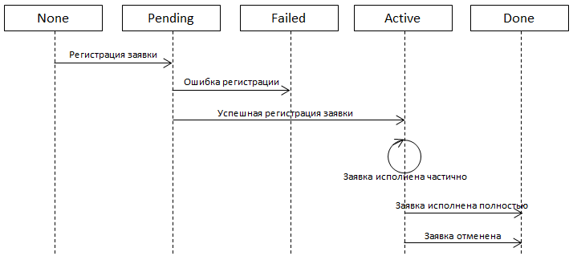

# Orders states

The order during it’s life goes through the following states:



- [None](xref:StockSharp.Messages.OrderStates.None)

   \- the order has been created in the algorithm and has not been sent to the registration. 
- [Pending](xref:StockSharp.Messages.OrderStates.Pending)

   \- the order has been sent to the registration (

  [Connector.RegisterOrder](xref:StockSharp.Algo.Connector.RegisterOrder)

  ) and the 

  [ITransactionProvider.NewOrder](xref:StockSharp.BusinessEntities.ITransactionProvider.NewOrder)

   event for it has been called. The confirmation of the order acceptance from the exchange is expected. If successful, the 

  [Connector.OrderChanged](xref:StockSharp.Algo.Connector.OrderChanged)

  , event will be called and the order will be changed to the 

  [Active](xref:StockSharp.Messages.OrderStates.Active)

   state. Also the 

  [Order.Id](xref:StockSharp.BusinessEntities.Order.Id)

   and 

  [Order.Time](xref:StockSharp.BusinessEntities.Order.Time)

   properties will be initialized. In the case of the order rejection the 

  [Connector.OrderRegisterFailed](xref:StockSharp.Algo.Connector.OrderRegisterFailed)

   event with the error description will be called and the order will be changed to the 

  [Failed](xref:StockSharp.Messages.OrderStates.Failed)

   state. 
- [Active](xref:StockSharp.Messages.OrderStates.Active)

   \- the order is active on exchange. Such order will be active as long as all of the order 

  [Order.Volume](xref:StockSharp.BusinessEntities.Order.Volume)

   volume is matched, or it will be forcibly cancelled through 

  [ITransactionProvider.CancelOrder](xref:StockSharp.BusinessEntities.ITransactionProvider.CancelOrder)

  . If the order matched partially the 

  [ITransactionProvider.NewMyTrade](xref:StockSharp.BusinessEntities.ITransactionProvider.NewMyTrade)

   events about new trades on issued order have been called, as well as the 

  [Connector.OrderChanged](xref:StockSharp.Algo.Connector.OrderChanged)

   event, which the 

  [Order.Balance](xref:StockSharp.BusinessEntities.Order.Balance)

   notification about the order balance change passed. The latest event will be arised in the case of the order cancellation. 
- [Done](xref:StockSharp.Messages.OrderStates.Done)

   \- the order is no longer active on the exchange (been fully matched or cancelled). 
- [Failed](xref:StockSharp.Messages.OrderStates.Failed)

   \- the order has not been accepted by the exchange (or intermediate system, such as the broker server) for any reason. 

To find out the order trading state (what volume is matched, whether the order fully matched, and so on) the [IsCanceled](xref:StockSharp.Algo.TraderHelper.IsCanceled), [IsMatchedEmpty](xref:StockSharp.Algo.TraderHelper.IsMatchedEmpty), [IsMatchedPartially](xref:StockSharp.Algo.TraderHelper.IsMatchedPartially), [IsMatched](xref:StockSharp.Algo.TraderHelper.IsMatched) and [GetMatchedVolume](xref:StockSharp.Algo.TraderHelper.GetMatchedVolume) methods should be used: 

```cs
// any order
Order order = ....
// is the order was cancelled
Console.WriteLine(order.IsCanceled());
// or fully matched
Console.WriteLine(order.IsMatched());
// or just partially
Console.WriteLine(order.IsMatchedPartially());
// or non of any contracts was matched 
Console.WriteLine(order.IsMatchedEmpty());
// so we are getting the realized (=matched) order size.
Console.WriteLine(order.GetMatchedVolume());
```
