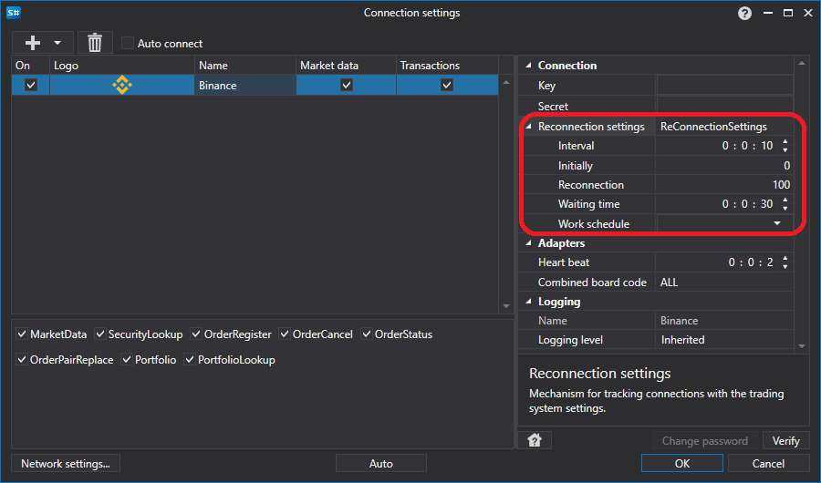
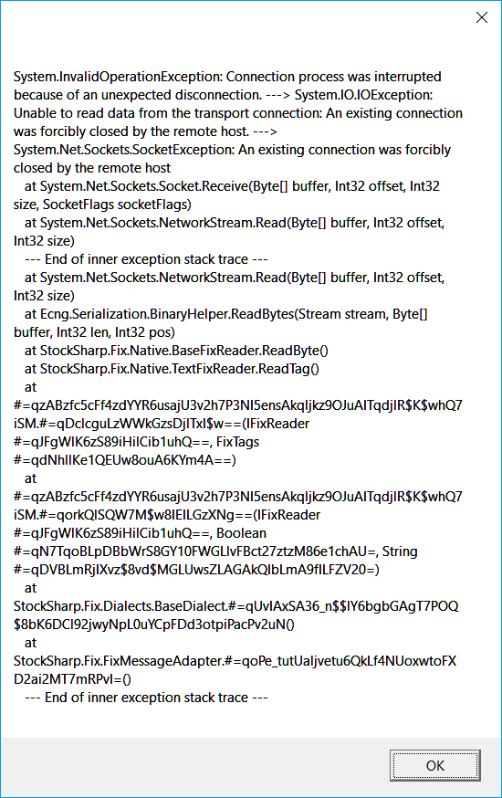
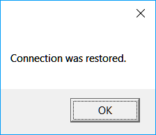

# Reconnection settings

### Visual reconnection settings

Visual reconnection settings

All connectors provide the ability to configure reconnection in case of disconnection. In the [Connection settings window](API_UI_ConnectorWindow.md) graphic element, it looks like this: 



**Reconnection properties**

- **Interval **

   \- The interval at which connection attempts will occur. 
- **Initially **

   \- The number of attempts to establish the initial connection if it was not established (timeout, network failure, etc.). 
- **Reconnection **

   \- The number of attempts to reconnect if the connection was disconnected during operation. 
- **Timeout **

   \- Timeout for successful connection\/disconnection. 
- **Operating mode **

   \- The operating mode during which it is necessary to make connections. 

### Code reconnection settings

Code reconnection settings

The reconnection mechanism is configured through the [Connector.ReConnectionSettings](xref:StockSharp.Algo.Connector.ReConnectionSettings) property and allows you to monitor the following error scenarios: 

- Unable to establish a connection (no communication, incorrect username\/password, etc.). The 

  [ReConnectionSettings.AttemptCount](xref:StockSharp.Messages.ReConnectionSettings.AttemptCount)

   property sets the number of attempts to establish a connection. By default, it is 0, which means that the mode is disabled. \-1 means an infinite number of attempts. 
- The connection was broken during operation. The 

  [ReConnectionSettings.ReAttemptCount](xref:StockSharp.Messages.ReConnectionSettings.ReAttemptCount)

   property sets the number of attempts to reconnect the connection. By default, it is 100. \-1 means an infinite number of attempts. 0 \- mode is disabled. 
- When connecting or disconnecting a connection, the corresponding 

  [IConnector.Connected](xref:StockSharp.BusinessEntities.IConnector.Connected)

   or 

  [IConnector.Disconnected](xref:StockSharp.BusinessEntities.IConnector.Disconnected)

   events may not be received for a long time. For such situations, you can use the 

  [ReConnectionSettings.TimeOutInterval](xref:StockSharp.Messages.ReConnectionSettings.TimeOutInterval)

   property to set the maximum acceptable timeout for a successful event. If, after this time, the desired event does not occur, the 

  [IConnector.ConnectionError](xref:StockSharp.BusinessEntities.IConnector.ConnectionError)

   event is raised with a timeout error. 

1. When creating a gateway, you need to initialize the settings of the reconnection mechanism through the [Connector.ReConnectionSettings](xref:StockSharp.Algo.Connector.ReConnectionSettings) property: 

   ```cs
   // initialize the reconnection mechanism (it will automatically connect 
   // every 10 seconds if the gateway loses connection with the server)
   Connector.ReConnectionSettings.Interval = TimeSpan.FromSeconds(10);
   // reconnection will work only during the operation of the RTS exchange
   // (to disable reconnection when there is no trading normally, for example, at night)
   Connector.ReConnectionSettings.WorkingTime = Exchange.Rts.WorkingTime;
   ```
2. To check how the connection control mechanism works, you can turn off the Internet connection: 
3. Below is the program log, which shows that the application is initially in a connected state, and after turning off the Internet connection, the application tries to reconnect. After restoring the Internet connection, the application connection is restored: 

   
4. Since several connections can be used in [Connector](xref:StockSharp.Algo.Connector), by default events related to reconnection, such as [Connector.Restored](xref:StockSharp.Algo.Connector.Restored) are not triggered, and connection adapters try to reconnect themselves. For the event to start being raised, you need to set the value of the adapter's [BasketMessageAdapter.SuppressReconnectingErrors](xref:StockSharp.Algo.BasketMessageAdapter.SuppressReconnectingErrors) property to **false**. 

   ```cs
   Connector.Adapter.SuppressReconnectingErrors = false;
   Connector.ConnectionError += error => this.Sync(() => MessageBox.Show(this, "Connection lost"));
   Connector.Restored += () => this.Sync(() => MessageBox.Show(this, "Connection restored"));
   ```

   
