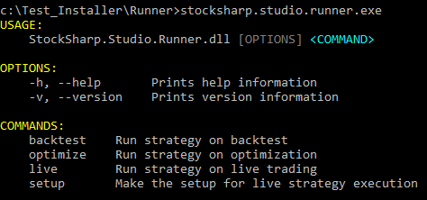

# Command Line

**Runner**, being a console application, offers the ability to launch in different modes by specifying parameters on the command line. Launching the program without parameters will display a help message showing the available parameters:



Launching **Runner** for historical data testing:

```cmd
b -s SmaStrategy.cs -h "C:\Storage" --hf 20200401 --ht 20200430 --sec SBER@TQBR -r json
```

Available parameters:

- -s - path to the strategy file (with cs, json, or dll extension).
- -t - (optional) if a dll file is selected, and the assembly contains more than one strategy class, it is necessary to specify the required type through this parameter.
- -h - path to the directory with historical data. Can be a network address in case of using server mode [server](HydraServer.md).
- --hl - (optional) login, used in server mode [server](HydraServer.md).
- --hp - (optional) password, used in server mode [server](HydraServer.md).
- --hf - start date for testing in YYYYMMDD format.
- --ht - end date for testing in YYYYMMDD format.
- -f - (optional) storage format (Binary or Csv).
- --sec - (optional) [instrument identifier](SecurityId.md).
- -r - (optional) format of the test result report (json, xml, csv).
- --tm - (optional) strategy timeout.
- --memory - (optional) maximum memory size (in megabytes).
- --cpu - (optional) processor mask.
- -l - (optional) logging level (Info, Debug, Error, Warning, Verbose).

Launching **Runner** for optimization:

```cmd
o -s SmaStrategy.cs -h "C:\Storage" --hf 20200401 --ht 20200430 --sec SBER@TQBR -r json -p sma_optimization.json
```
All parameters from the historical testing mode, plus additional ones:

- -p - path to the parameters file.
- --ol - (optional) maximum number of iterations.
- --ob - (optional) number of strategies tested simultaneously.

Parameters file format:

```json
[
  {
    "Name": "SMA_80",
    "Value": "200,201"
  },
  {
    "Name": "SMA_30",
    "From": "40",
    "To": "50",
    "Step": "1"
  },
  {
    "Name": "Security",
    "Value": "SBER@TQBR,GAZP@TQBR"
  }
]
```

Launching **Runner** for live trading:

```cmd
l -s SmaStrategy.cs -c connector.json --tg telegram.json
```

- -c - connection settings file.
- --tg - telegram integration settings file.
