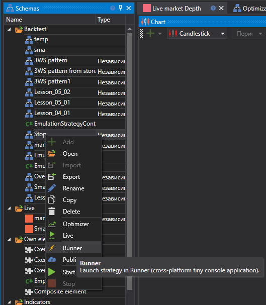
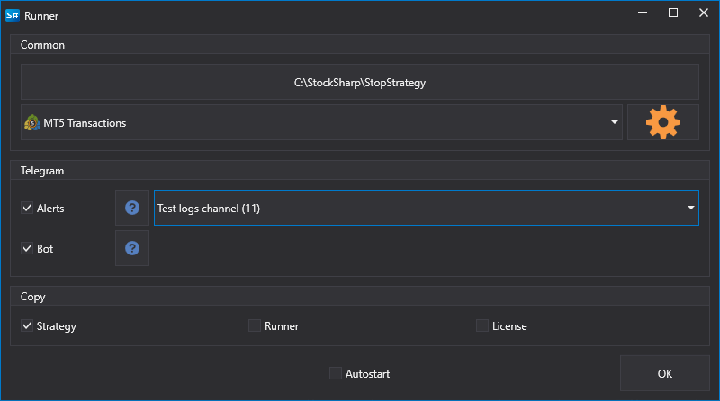

# Export from Designer

**Runner** allows you to run strategies created in [Designer](Designer.md). This is the most convenient way to set up **Runner** as all configurations are done visually.

To export a strategy from [Designer](Designer.md):

- Select the desired strategy in the tree, right-click it, and choose the **Runner** menu item:

  

- In the window that appears, you need to select which types of connections need to be exported to **Runner**, as well as settings for managing the strategy via [Telegram](Telegram.md):

  

The following files will be copied to the selected export directory:

- connector.json - a file containing connection settings
- params.json - a file containing strategy parameters
- start.bat - a bat file with a command line already written for quick **Runner** startup
- strategy.json - a file containing the strategy
- connector.json - a file containing connection settings
- telegram.json - a file containing settings for integration with [Telegram](Telegram.md)
