# Connection Setup

**Runner**, in addition to [exporting settings through Designer](RunnerDesignerExport.md), offers the ability to configure the program through its console interface. To do this, you need to run the program with the **setup** command:

```cmd
stocksharp.studio.runner setup
```

A menu will appear:

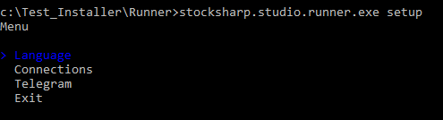

By selecting the Connections item, the program will enter the connector setup mode:

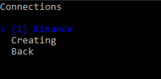

Here you can either edit a previously saved connection or create a new one:

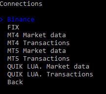

After selecting the required type of new connection, the program will move to the editing menu of its settings:

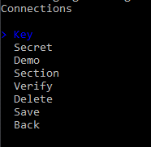

For [Binance](Binance.md), you need to enter its main settings:


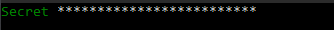


To verify the correctness of the entered data, select **Check**:

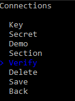

The connection check will start:


In case of success, a message will be displayed:


After entering all settings and verifying them, you must press **Save**:

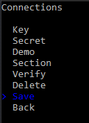

In the Data folder, a **connector.json** file will be created (if it was not created earlier), which will contain the saved settings.

To set up integration with [Telegram](Telegram.md), select the menu item:

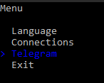

And authenticate by a convenient method:

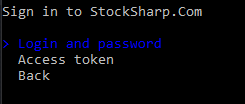

For authentication by token, enter the token from [https://stocksharp.ru/profile/](https://stocksharp.ru/profile/):

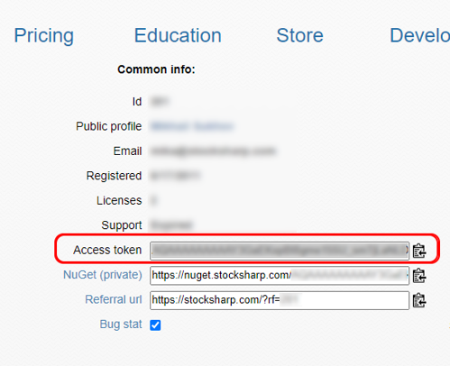

In case of success, the program will display the available Telegram operation options:

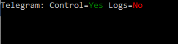
