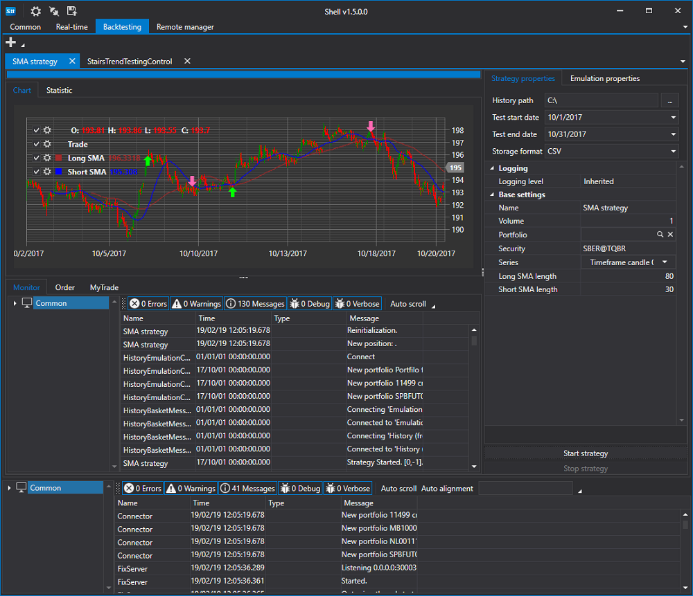

# S\#.Shell

**S\#.Shell** \- is a ready\-made graphical framework with the ability to change quickly to your needs and with a fully open source code in C\# language (enough basic knowledge). 

You don't need to waste time creating a GUI (Graphical User Interface), a ready\-made robot is created faster without sacrificing application usability. Basic functionality for testing, trading, connecting to data sources, displaying charts, portfolios, positions, orders and trades is already in the box.

The main features of the trading robot shell:

1. Full source code. Ideal for custom robots, or for your solutions.
2. **Support for more than 70 connections** to various exchanges of the world [Connectors](API_Connectors.md).
3. Flexible user interface.
4. Testing strategies (statistics, equity, report).
5. Save and restore strategy settings.
6. Simultaneous launch of strategies.
7. Detailed information about the strategy operation (orders, trades, position, profit, logs, etc.). Everything is clear and simple.
8. Running strategies on schedule.

## Recommended content

[Installing S\#.Designer](Designer_Installation.md)
