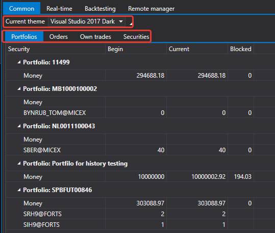
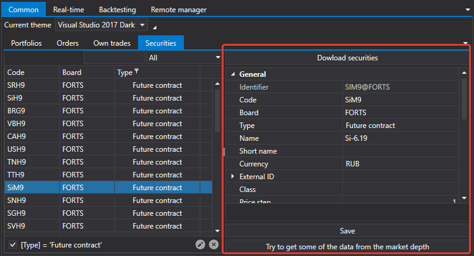

# Common

The [Common](Shell_Common.md) tab allows you to view general information on portfolios, orders, trades, securities. Also here you can set the theme of the [S\#.Shell](Shell.md) interface.

On the **Securities** tab, you can upload securities from the local storage and modify security settings.

## Recommended content

[Real\-time](Shell_RealTime.md)
