# RemoteManager

The [RemoteManager](Shell_RemoteManager.md) tab allows you to enable remote control mode. To enable this mode, you must go to the user configuration menu.

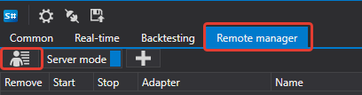

In the window that appears, set your **login** and **password**

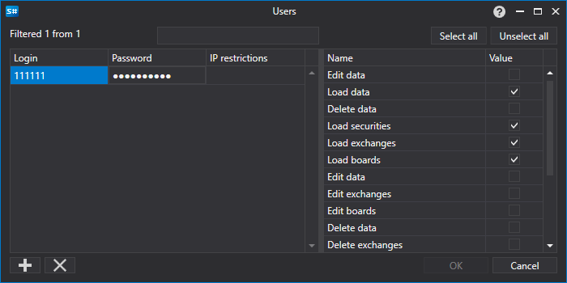

Then you need to enable the **server mode**. 

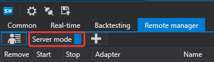

You can now connect to Shell from another Shell.

To do this, you need to run **another Shell**. In it go to the connection settings.

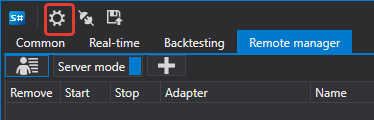

In the window that opens, set up Fix connection

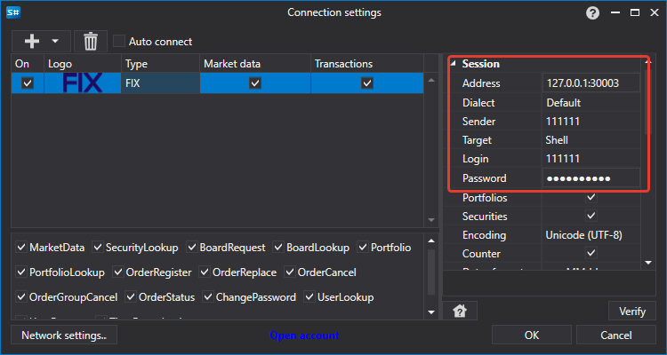

Then press the connection button

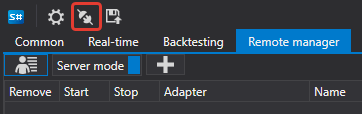

When connected, all existing strategies in the Shell server will be available in the Shell client

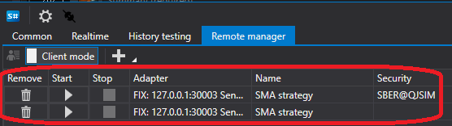

By clicking the Add button, you can add another strategy to trade.

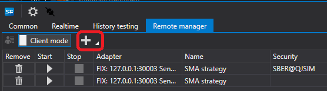

Because Shell client supports multiple servers. So when choosing to add a strategy, you must select the server on the left, and on the right there will be all strategies available on the server.

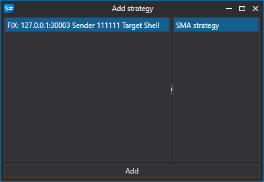

After adding a strategy, it will appear in the list of strategies.

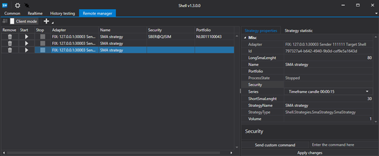

When selecting a strategy, there will be tabs on the right with the strategy settings, as well as its statistics.

After changing the strategy settings, be sure to click the Apply changes button, otherwise the changes will not be applied to the strategy.

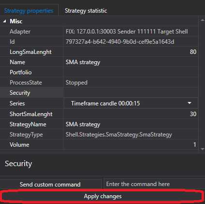

If the strategy has a command other than Start\/Stop, then to apply it you must set it in the next field.

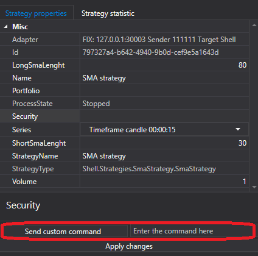

And click the send command button.

To set your team in the strategy, you need to override the [Strategy.ApplyCommand](xref:StockSharp.Algo.Strategies.Strategy.ApplyCommand) method.

```cs
public virtual void ApplyCommand(StrategyStateMessage stateMsg)
		
```

The [Strategy](xref:StockSharp.Algo.Strategies.Strategy) base class only controls the strategy start and stop.

## Recommended content

[Connections settings](Shell_Connection_settings.md)
