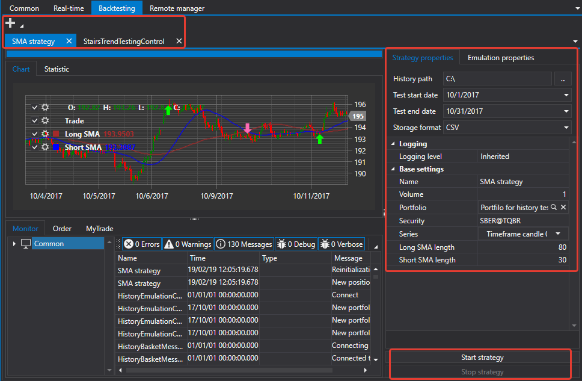

# Emulation

The [Emulation](Shell_emulation.md) tab allows to test strategies on historical data.

By clicking the **Add**  button, you can add a strategy for testing. Each added strategy is opened on an individual tab.

Individual strategy tab has extensive information on the strategy, statistics, list of registered orders and trades of the strategy, etc. On this tab, you can configure testing parameters, the path to historical data, the start and end dates of testing, the format of the historical data storage. 

## Recommended content

[RemoteManager](Shell_RemoteManager.md)
