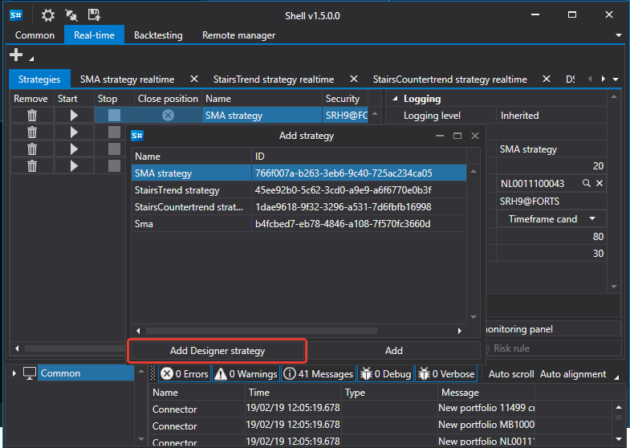
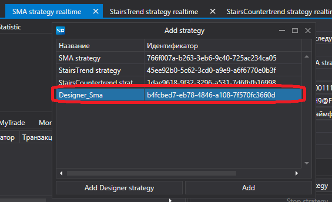
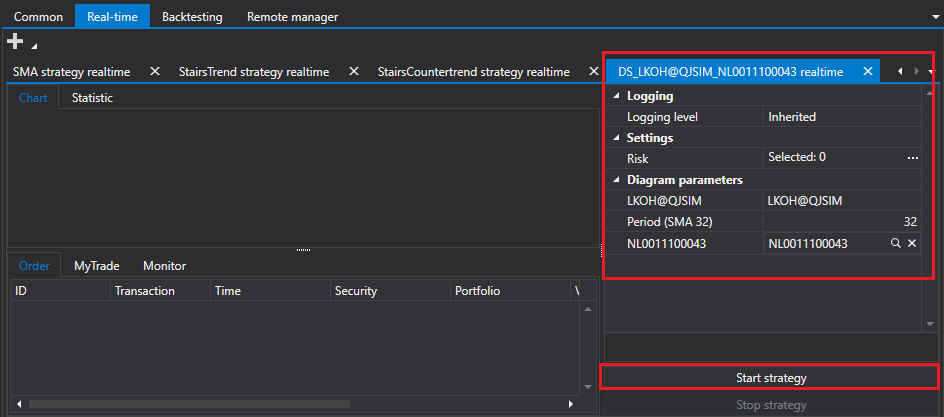

# Run strategies from S\#.Designer

[S\#.Shell](Shell.md) can run strategies created in [S\#.Designer](Designer.md).

To launch a strategy created in [S\#.Designer](Designer.md), you need to select it on the [Real\-time](Shell_RealTime.md) select tab and click the **Add Designer strategy** button. In the window that appears, select the strategy file exported from [S\#.Designer](Designer.md). 

After that, it will appear in the list of available strategies.

By selecting the added strategy, you can set the necessary parameters and launch it in the trade.

## Recommended content

[Create strategy](Shell_custom_strategy.md)
