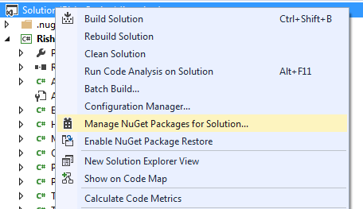
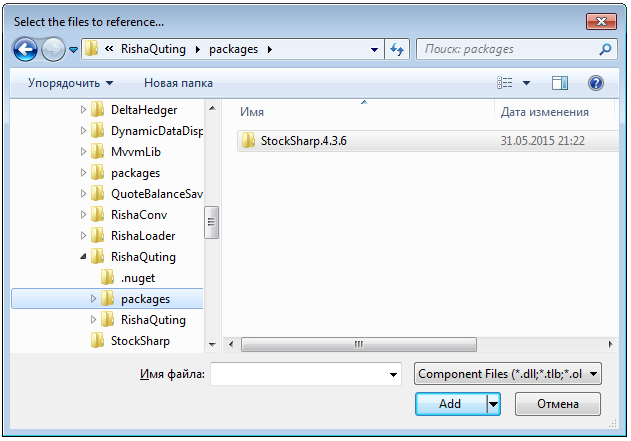

# Installation instruction

Starting from version 5.0, all installation is done through NuGet. More details, [S\#.API install](https://stocksharp.com/news/266/StockSharp-API-from-Nuget-Manual/)

> [!CAUTION]
> The information below is relevant only for versions 4.XXX

There are two ways to install [S\#](StockSharpAbout.md):

1. Install from the [StockSharp Releases](https://github.com/StockSharp/StockSharp/releases/) repository of the [GitHub](https://github.com/) web service.
2. Install from the Visual Studio using the service Nuget.

## Install from GitHub

1. Sign up on [GitHub](https://github.com/).
2. Go to[github.com\/StockSharp\/StockSharp](https://github.com/StockSharp/StockSharp) page in StockSharp repository.
3. Select the **releases** icon, as shown in the following figure.
4. Select the required [S\#](StockSharpAbout.md) version on the opened page, and download the necessary archives from the **Downloads** section.

   > [!TIP]
   > Note that the Source Code archives contain source code and StockSharp\_\#.\#.\#.Zip archives contain library files (references) and examples source code.  
   > 
5. Unlock and unzip the downloaded files.

## Install using the Nuget

> [!TIP]
> The only binary files of [S\#](StockSharpAbout.md) will be downloaded from Nuget. To get the Samples you should to visit GitHub.

1. In **Solution Explorer** right\-click the solution name, and select **Manage NuGet Packages for Solution...** in the context menu.

   > [!TIP]
   > Another way to open **TOOLS \=\> NuGet Package Manager \=\> Manage NuGet Packages for Solution...** item in the Studio’s main menu.
2. Select the tab Online **Online** in the opened window and type StockSharp in the search bar. Click Install **Install** after the StockSharp API (S\#.API) installation package found.
3. “Packages” folder appears in the solution folder after the package installation and the StockSharp.\#.\#.\# folder with the latest [S\#](StockSharpAbout.md) version in it.

## Recommended content

[Video \- "Installing StockSharp"](https://youtu.be/9YThBGMeVKE)
