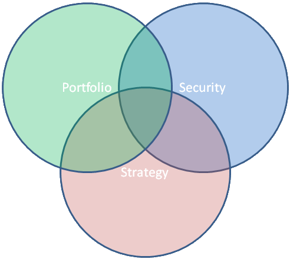

# Creating strategies

The basis of the creating strategies is the [Strategy](xref:StockSharp.Algo.Strategies.Strategy) class, which includes the main trading options such as: portfolio, instrument, the current position, profit\-loss, etc. 

It is recommended that the strategy code has been implemented without binding to specified instrument or portfolio. This approach allows you to use strategy with different instruments on different trading accounts simultaneously or in different time periods: 



The [Strategy](xref:StockSharp.Algo.Strategies.Strategy) class uses an approach [based on events](EventModel.md). Such code is compact and quickly reacts to market events due instant recall. If you use the [iteration model](StrategyCreate.md), the code is called only after the [TimeFrameStrategy.TimeFrame](xref:StockSharp.Algo.Strategies.TimeFrameStrategy.TimeFrame) timeframe end, and there is a chance to miss the necessary signals in the market. Therefore, it is recommended to use in the [S\#](StockSharpAbout.md) only events to create the logic of the strategies (all standard [S\#](StockSharpAbout.md) strategies implement this approach). 

To use event\-driven approach, you must use the [Strategy.Rules](xref:StockSharp.Algo.Strategies.Strategy.Rules) property. The list of rules set through this property. Each of the rules stores an event trigger condition and the action itself, which handles this event. Here is the [DeltaHedgeStrategy](xref:StockSharp.Algo.Strategies.Derivatives.DeltaHedgeStrategy) strategy code, which uses the event model: 

```cs
/// <summary>
/// Delta hedging options strategy.
/// </summary>
public class DeltaHedgeStrategy : Strategy
{
    private readonly Strategy _tradingStrategy;
    /// <summary>
    /// Create <see cref="DeltaHedgeStrategy"/>.
    /// </summary>
    /// <param name="tradingStrategy">A strategy that contains child strategies that trade on a separate strike.</param>
    public DeltaHedgeStrategy(Strategy tradingStrategy)
    {
        if (tradingStrategy == null)
            throw new ArgumentNullException("tradingStrategy");
        _tradingStrategy = tradingStrategy;
    }
    protected override void OnStarted()
    {
        _tradingStrategy
            .WhenNewMyTrade()
            .Do(ReHedge).Apply(this);
        Security.WhenChanged(Connector).Do(ReHedge).Apply(this);
        base.OnStarted();
    }
    private void ReHedge()
    {
        if (base.ChildStrategies.Count > 0)
        {
            this.AddWarningLog("Re-hedging has already been launched.");
            return;
        }
        var futurePosition = _tradingStrategy.ChildStrategies.SyncGet(c => c.Sum(strategy =>
        {
            var delta = strategy.Security.Delta;
            this.AddInfoLog("The Delta for the {0} tool is equal to {1}.", strategy.Security, delta);
            this.AddInfoLog("Position {0}.", strategy.PositionManager.Position);
            return delta * strategy.PositionManager.Position;
        }));
        this.AddInfoLog("Delta total {0}.", futurePosition);
        var diff = (int)futurePosition.Round() + (int)base.PositionManager.Position;
        if (diff != 0)
        {
            this.AddInfoLog("The difference in position {0}.", diff);
            base.ChildStrategies.Add(CreateQuoting(diff > 0 ? Sides.Sell : Sides.Buy, diff.Abs()));
        }
    }
    /// <summary>
    /// Create a quote strategy to change the position.
    /// </summary>
    /// <param name="direction">Direction of quotation.</param>
    /// <param name="volume">The volume of quotation.</param>
    /// <returns>The strategy of quoting.</returns>
    protected virtual QuotingStrategy CreateQuoting(Sides direction, int volume)
    {
        return new MarketQuotingStrategy(direction, volume);
    }
}
		
```

This strategy at start adds the rule on new trades event (for rehedging): 

```cs
_tradingStrategy.WhenNewMyTrade().Do(ReHedge).Apply(this);
		
```

and also the rule for event of the futures contract change (its price): 

```cs
Security.WhenChanged(Connector).Do(ReHedge).Apply(this);
		
```

In the [DeltaHedgeStrategy](xref:StockSharp.Algo.Strategies.Derivatives.DeltaHedgeStrategy) rules are added by calling the [MarketRuleHelper.Apply](xref:StockSharp.Algo.MarketRuleHelper.Apply(StockSharp.Algo.IMarketRule,StockSharp.Algo.IMarketRuleContainer))**(**[StockSharp.Algo.IMarketRule](xref:StockSharp.Algo.IMarketRule) rule, [StockSharp.Algo.IMarketRuleContainer](xref:StockSharp.Algo.IMarketRuleContainer) container**)** add\-in method, that implicitly adds new [Strategy.Rules](xref:StockSharp.Algo.Strategies.Strategy.Rules) objects to the [IMarketRule](xref:StockSharp.Algo.IMarketRule) list. This reduces the code and make it more readable. As long as the rule is not added to the strategy \- it is inactive. 

By default the rule is recurring, i.e. it is called as many times, as an event occurs. It will continue as long as the strategy is working, to which a rule is added ([Strategy.ProcessState](xref:StockSharp.Algo.Strategies.Strategy.ProcessState) equals [ProcessStates.Started](xref:StockSharp.Algo.ProcessStates.Started)). If you want to create a rule that will be active from other condition (for example, a rule that closes the position when strategy stops **should not** depend on the [ProcessStates.Started](xref:StockSharp.Algo.ProcessStates.Started)) value), then you need to call the [MarketRule\<TToken,TArg\>.Until](xref:StockSharp.Algo.MarketRule`2.Until(System.Func{System.Boolean}))**(**[System.Func\<System.Boolean\>](xref:System.Func`1) canFinish**)** method. The criterion for the rule end is passed to this method 

> [!CAUTION]
> If the strategy has been forcibly stopped through the [Strategy.Stop](xref:StockSharp.Algo.Strategies.Strategy.Stop) method (for example, when the user clicks on the program window), the strategy is not immediately stopped and goes into the [ProcessStates.Stopping](xref:StockSharp.Algo.ProcessStates.Stopping) state and will remain active as long as the list with the [Strategy.Rules](xref:StockSharp.Algo.Strategies.Strategy.Rules) rules is not empty (that means that some rules are still active). Therefore, you must be careful with the addition of a rule stopping criterion not to make a strategy unstoppable. 

## Next Steps

[Child strategies](StrategyChilds.md)

## Recommended content

[Event model](EventModel.md)
