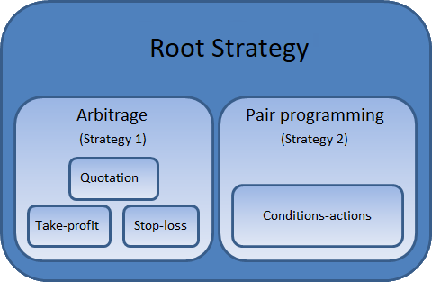

# Child strategies

With the [Strategy](xref:StockSharp.Algo.Strategies.Strategy), you can also create child strategies. For example, when you want to implement the trading process, which operates with standard (or previously implemented) algorithms, building them into a single chain: 

### Prerequisites

[Creating strategies](StrategyCreate.md)

### Work with child strategies

To add a child strategy you should use the [Strategy.ChildStrategies](xref:StockSharp.Algo.Strategies.Strategy.ChildStrategies) property. It is possible not to set [Strategy.Connector](xref:StockSharp.Algo.Strategies.Strategy.Connector), [Strategy.Portfolio](xref:StockSharp.Algo.Strategies.Strategy.Portfolio) and [Strategy.Security](xref:StockSharp.Algo.Strategies.Strategy.Security) values for child strategies, and they are automatically filled when you add them to the parent strategy. 

When adding a new child strategy, it automatically receives the state from the parent. For example, if the parent strategy is in operating state ([ProcessStates.Started](xref:StockSharp.Algo.ProcessStates.Started)), then the child is automatically set in the operating state (vice versa, in the case of the [ProcessStates.Stopped](xref:StockSharp.Algo.ProcessStates.Stopped)). 

Therefore, to call the [Strategy.Start](xref:StockSharp.Algo.Strategies.Strategy.Start) method for the child strategy is not necessary. It will be called automatically when the parental strategy starts. Thus, the [Strategy.Start](xref:StockSharp.Algo.Strategies.Strategy.Start) method can be called only for the root strategies. 

The parent strategy and all its child strategies are executed in parallel. This means that, if the [iteration model](StrategyCreate.md) has been selected, the [TimeFrameStrategy.OnProcess](xref:StockSharp.Algo.Strategies.TimeFrameStrategy.OnProcess) methods for child and parent strategies are executed in parallel. The same situation with the [Strategy.Rules](xref:StockSharp.Algo.Strategies.Strategy.Rules) rules, the [event model](StrategyAction.md) has been selected. 

> [!TIP]
> The [Strategy.Stop](xref:StockSharp.Algo.Strategies.Strategy.Stop) method for the child strategy, unlike [Strategy.Start](xref:StockSharp.Algo.Strategies.Strategy.Start), can be called at any time. For example, when the algorithm needs to forcibly stop the operation of the child strategy, while the algorithm of the child strategy itself has not yet been executed to the end (for example, to interrupt [Quoting](StrategyQuoting.md)). 

By default, child strategies are not associated with each other, and are executed independently. When you need to establish a dependency between the strategies, you must use the [BasketStrategy](xref:StockSharp.Algo.Strategies.BasketStrategy) class. This class allows you to specify conditions for the strategies terminations depending on each other through the [BasketStrategyFinishModes](xref:StockSharp.Algo.Strategies.BasketStrategyFinishModes) indicators. For example, through the [First](xref:StockSharp.Algo.Strategies.BasketStrategyFinishModes.First) value the condition set wherein all child strategies will be stopped, when at least one of them matched. The example of the [BasketStrategy](xref:StockSharp.Algo.Strategies.BasketStrategy) use is shown in the [Take\-profit and stop\-loss](StrategyProtective.md). 

### Next Steps

[Quoting](StrategyQuoting.md)

[Take\-profit and stop\-loss](StrategyProtective.md)
