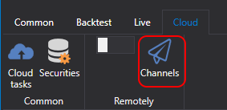

# Alerts

A service for sending messages from applications (such as [Designer](Designer.md) or your own custom program) to both private and public channels or groups in the Telegram messenger.

To configure:

1. Complete the [bot authorization process](TelegramAuth.md).

2. Create a channel or group (either private or public).

   
   

3. Add the bot [StockSharpBot](https://t.me/StockSharpBot)

   

4. Make it an administrator

   

5. Necessary permissions for correct operation

   

6. Write the special word **activate** in the channel or group

   

7. If successful, you will receive a response

   

The channel you've created is now available for your strategies and trading robots:

- When using [Designer](Designer.md), press on the channel list at the top panel:

  

  In the window that appears, you will see lists of all the channels and groups where you've activated the bot:

  

  Pressing the Telegram icon button will send a test message. If it's received, it means everything has been set up correctly.

  

  *In the free tariff, a line mentioning the StockSharp site is added. In paid tariffs, this line is removed.*

If you have several output channels in Telegram and you want to direct different strategies to different channels, you can specify specific channels for each strategy in the settings:

- In other programs, settings are done similarly to [Designer](Designer.md). For example, in the [Hydra](Hydra.md) program, you can configure error logging for market data download if [Hydra](Hydra.md) is located on a server, and you need to promptly receive information about a non-working connection.
- In the case of [Shell](Shell.md) or [S#](StockSharpAbout.md), you can view the code that integrates your strategies with the Telegram service.
