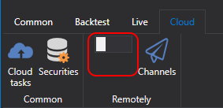
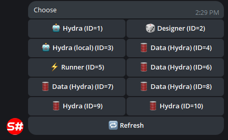
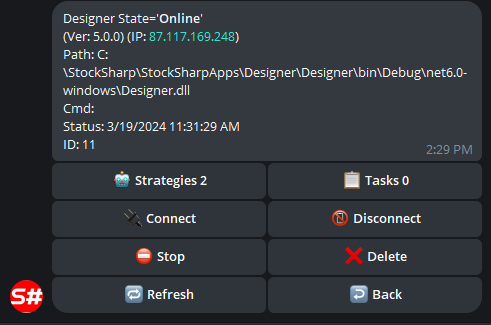
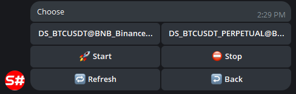
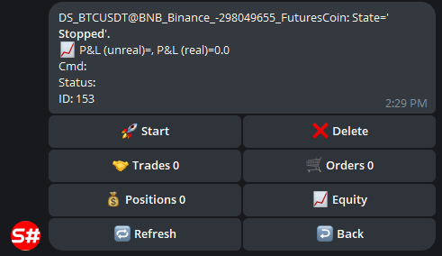
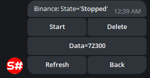
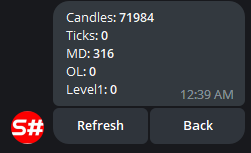

# Control Panel

A service for managing trading strategies and robots via a Telegram bot.

For setup, go through the [bot authorization process](TelegramAuth.md) beforehand.

After that, the bot is ready for use. Next, for the bot to start seeing your strategies, you need to:

- In the case of using the [Designer](Designer.md) program, enable the Remote mode on the Cloud panel:

  

  All strategies that are run in Live mode will automatically be transferred to the telegram bot, and you will be able to control them from your phone.

  In the bot [StockSharpBot](https://t.me/StockSharpBot) by selecting the /apps command you can see a list of all programs:

  

  Once the desired program is selected, you can see the strategies and their controls:

  

  

  

- In the case of using [Shell](Shell.md), you need to go to the Remote Manager panel and make settings similar to [Designer](Designer.md).
- In the case of using [Hydra](Hydra.md), all actions are done similarly to [Designer](Designer.md). Integration with [Hydra](Hydra.md) allows you to manage the downloading of market data, monitor quantitative statistics.

  
  

- In the case of using [S#](StockSharpAbout.md), you can make integration using the code from [Shell](Shell.md). Thanks to [S#](StockSharpAbout.md) being cross-platform, your robots can be run on any operating system.