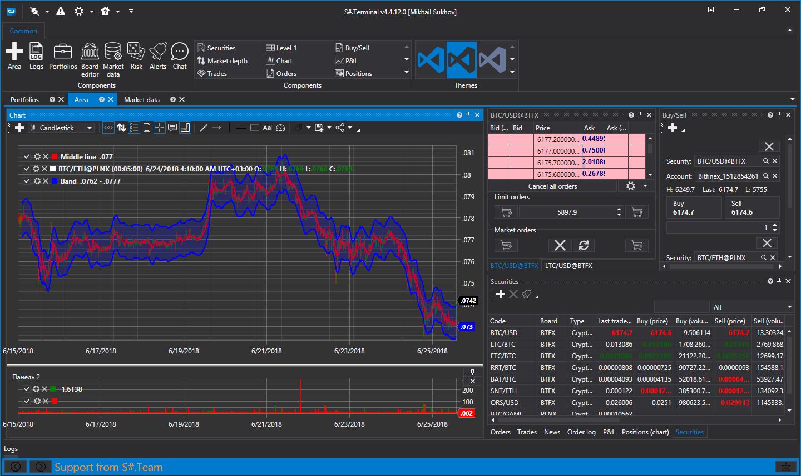

# Terminal

**Terminal** is a free trading terminal. The main advantage of which is the simultaneous connection to a variety of trading boards, including those where there is no own terminal. 

## Advantages and features of Terminal:

1. **Supports many sources:**[Connectors](API_Connectors.md).
2. **Trade from the chart**. 
3. **Arbitrary time frames**. 
4. **Support for Volume, Tick, Range, PnF, Renko Candles**. 
5. **Clusters and box plots**. 
6. **Any markets:** stocks, futures, Forex, bitcoins. 

## Recommended content

[Installing Terminal](Terminal_Installation.md)
