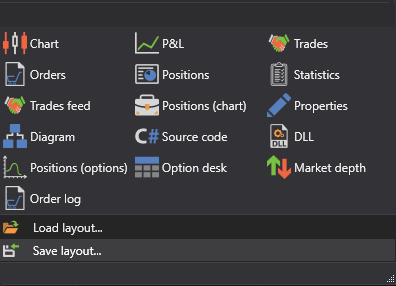

# Components

During trade there is a need to fully control the process. For complete control and analysis, **Terminal** provides graphical components that you can add by selecting them in the **Components** group of the **Ribbon**:

- [Instruments](Terminal_Securities.md) \- is a table with instruments that displays information about all selected instruments.
- [Level 1](Terminal_level1.md) \- is a table with a history of changing Level 1 for the selected instruments.
- [Buy\/Sell](Terminal_Buy_Sell.md) \- is a panel group that displays the best price information for the selected instruments, as well as you can buy or sell the required volume for the selected instruments.
- [Order book](Terminal_Depth_Panel2.md) \- is a table of limit orders for purchase and sale. 
- [Chart](Terminal_Chart.md) \- allows you to draw candles and indicators for the selected instrument. 
- [P&L equity](Designer_Panel_Market_depth.md) \- is a chart of Profit\/Loss (unrealized), Profit\/Loss (realized) and commission.
- [Trades](Designer_Trades.md) \- is a table with trades, that displays complete information about all trades of the strategy.
- [Orders](Designer_Orders.md) \- is a table with orders, that displays complete information about all orders of the strategy.
- [Conditional orders](Designer_Orders_conditional.md) \- is a table with conditional orders, that displays complete information about all conditional orders of the strategy.
- [Positions](Designer_Chart_Position.md) \- is a table of the current Position. 
- [Tick trades](Designer_Tape_Trades.md) \- is a trade table that displays complete information about all trades for the selected instruments.
- [Positions](Designer_Chart_Position.md) \- is a chart of the Position.
- [News](Terminal_news.md) \- displays news received from connections.
- [Positions (options)](Terminal_options_positions.md) \- is a graphic display of the position by options.
- [Option desk](Terminal_option_desk.md) \- is a table of the main parameters of the selected options for the underlying instrument.
- [Smile volatility](Terminal_smile_of_volatility.md) \- is a graphic representation of the expected volatility level for options with the same underlying asset and different strikes.
- [Order log](Terminal_orderlog.md) \- is a table with orders, which displays complete information about all orders for the selected instruments.
