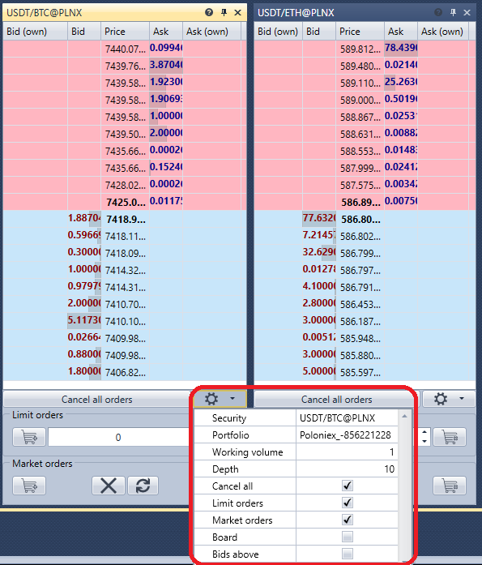

# Order book

The **Order book** component is a table of limit orders for the purchase and sale. 

When you click the settings  button, a panel appears in which you can set the necessary instrument and portfolio, as well as configure the order book display options. 

Orders can be registered either by clicking the **Buy\/Sell** buttons or by clicking the cell of the **Bid\/Offer** columns in the order book itself.

## Recommended content

[Positions](Designer_Chart_Position.md)
