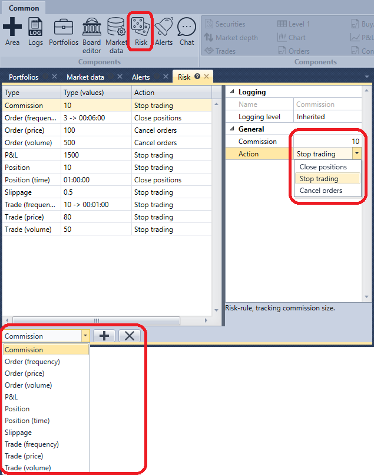

# Risk management

In the **Risk** panel, you can set risk control settings.

At the bottom of the panel, you have to select the **Risk\-rule**, configure the trigger condition for the **Risk\-rule** and the action (Close positions, Stop trading, Cancel orders), which will be executed when the **Risk\-rule** condition is triggered.

The list of risk rules and their description is available in the section [Risk management](Designer_Risk_Rule.md).

## Recommended content
