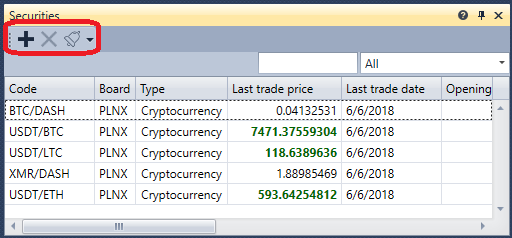

# Instruments

The **Instruments** component is a table with instruments that displays information about all selected instruments.

To add a new instrument, click the  button. 

t is also possible to configure notifications for events of the selected instruments \- [Notification settings](Terminal_Notifications.md).

## Recommended content

[Level 1](Terminal_level1.md)
