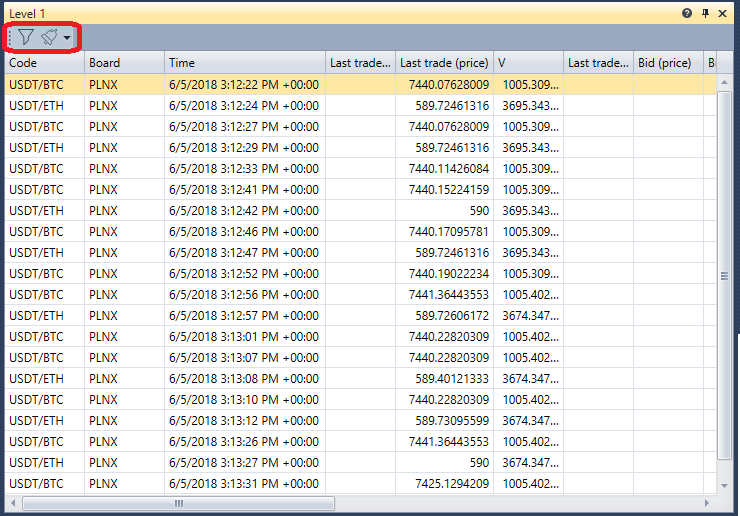

# Level 1

The **Level 1** component is a table with a history of changing **Level 1** for the selected instruments.

**Level 1** has a filter to select the necessary instruments. It is also possible to configure notifications for events of the selected instruments \- [Notification settings](Terminal_Notifications.md).

## Recommended content

[Buy\/Sell](Terminal_Buy_Sell.md)
